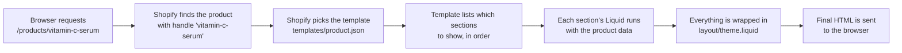
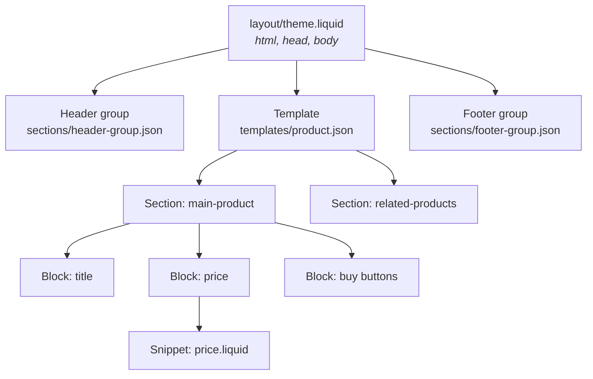
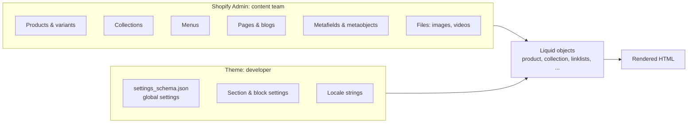
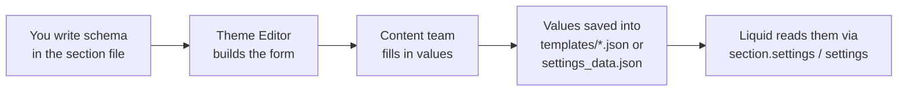
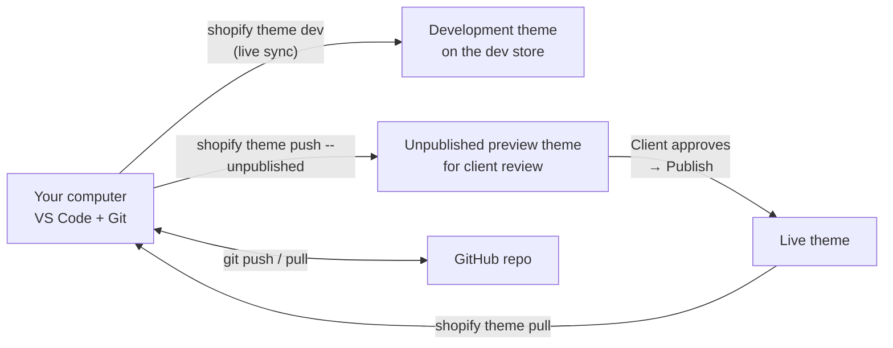
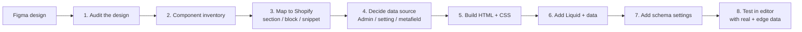
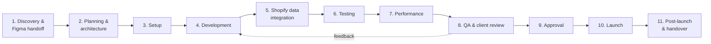
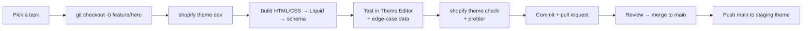

# Shopify Theme Development: From Zero to Production

> **Who this is for:** Any developer who already knows **HTML, CSS and JavaScript** but is **new to Shopify and Liquid**.
>
> **What you will get:** By the end, you will understand how a Shopify theme works. You will also know where the data comes from, how to turn a Figma design into editable Shopify sections, how to make the site fast, and how a professional takes a project all the way to production.
>
> **How examples work in this guide:** Every code example is **small, standalone, and written for learning**. You can copy it into any theme. After most examples, there is a **🔍 See it in Dawn** line. It points to the matching file inside Shopify's Dawn theme, so you can study a real production version of the same idea.
>
> **Companion file:** Day-to-day commands (Theme Check, Prettier, push/pull, commit checklist) live in [DEVELOPER-GUID.md](DEVELOPER-GUID.md). This guide does not repeat them.

---

## Table of Contents

- [Part 0: How to Use This Guide (Start Here)](#part-0-how-to-use-this-guide-start-here)
- [Part 1: Shopify in Plain Words](#part-1-shopify-in-plain-words)
- [Part 2: Liquid Basics](#part-2-liquid-basics)
- [Part 3: How a Theme Is Structured](#part-3-how-a-theme-is-structured)
- [Part 4: Sections, Blocks, Snippets and Settings](#part-4-sections-blocks-snippets-and-settings)
- [Part 5: Where Does the Data Come From?](#part-5-where-does-the-data-come-from)
- [Part 6: Metafields and Metaobjects](#part-6-metafields-and-metaobjects)
- [Part 7: The Theme Editor (Customizer)](#part-7-the-theme-editor-customizer)
- [Part 8: Setting Up Without a Real Store](#part-8-setting-up-without-a-real-store)
- [Part 9: Dawn or Build From Scratch?](#part-9-dawn-or-build-from-scratch)
- [Part 10: Figma → Shopify Workflow (with a Full Example)](#part-10-figma--shopify-workflow-with-a-full-example)
- [Part 11: If You Build a Theme From Scratch](#part-11-if-you-build-a-theme-from-scratch)
- [Part 12: Performance](#part-12-performance)
- [Part 13: The Professional Production Process](#part-13-the-professional-production-process)
- [Part 14: Your 25-Step Implementation Plan](#part-14-your-25-step-implementation-plan)
- [Part 15: Study Plan (Learn While You Build)](#part-15-study-plan-learn-while-you-build)
- [Part 16: Using Claude / Claude Code Safely](#part-16-using-claude--claude-code-safely)
- [Part 17: Quick Answers to Common Questions](#part-17-quick-answers-to-common-questions)
- [Part 18: Glossary and Cheat Sheet](#part-18-glossary-and-cheat-sheet)

---

## Part 0: How to Use This Guide (Start Here)

### The short answer to "Where do I start?"

You do **not** need to master Liquid before you start working. Liquid is a small language. Most of your time will go into understanding **how Shopify thinks**: where data lives, and how the pieces of a theme fit together.

Follow this order:

1. **Understand the architecture** (Parts 1, 3, 4). This takes about 2 days.
2. **Learn basic Liquid** (Part 2). This takes about 1–2 days.
3. **Understand the data** (Parts 5, 6, 7). This takes about 2 days.
4. **Get a development store running** (Part 8). This takes half a day.
5. **Build one small component end-to-end** (Part 10 example). This takes 1–2 days.
6. **Then start the real project.** Keep learning as you go (Part 15).

### Your first 7 days

| Day | Goal | What to do |
|---|---|---|
| 1 | Understand Shopify | Read Part 1. Create a Partner account and a development store (Part 8). Click through the whole Admin. |
| 2 | Learn the theme structure | Read Part 3. Open every folder in Dawn and read the file names. |
| 3 | Learn Liquid | Read Part 2. Try every example in a test section. |
| 4 | Learn sections and settings | Read Parts 4 and 7. Build the "Hero banner" example and edit it in the Theme Editor. |
| 5 | Learn the data | Read Part 5. Add 10 test products and 3 collections, then output them with Liquid. |
| 6 | Learn metafields | Read Part 6. Create one product metafield and show it on the product page. |
| 7 | Plan the project | Read Parts 10 and 13. Start your component inventory from Figma. |

### ✅ You're ready to start the project when…

- [ ] You can explain the difference between a **template**, a **section**, a **block** and a **snippet**.
- [ ] You know where a product's title, price and images come from.
- [ ] You can build a section that the content team can edit in the Theme Editor.
- [ ] You can run the theme locally against a development store.

---

## Part 1: Shopify in Plain Words

### What is Shopify?

Shopify is a **hosted e-commerce platform**. "Hosted" means Shopify runs the servers, the database, the checkout and the payments. You never manage a server or a database.

As a theme developer, you control **only the look and layout of the storefront**. The storefront is the part that shoppers see.

### The four parts of a Shopify store

| Part | What it is | Who works on it | Can you edit it with code? |
|---|---|---|---|
| **Shopify Admin** | The dashboard where the store owner adds products, collections, pages, menus and so on. | Store owner / content team | No. It is Shopify's app. |
| **Theme** | The files that decide how the storefront looks (Liquid, CSS, JS, JSON). | **You**, the theme developer | **Yes.** This is your job. |
| **Apps** | Extra features installed from the Shopify App Store (reviews, subscriptions, etc.). | App developers | Only through the settings each app gives you |
| **Checkout** | The payment pages. | Shopify | Very limited (branding, checkout extensions on Plus) |

> **Key idea:** The **Admin holds the data**. The **theme displays the data**. You do not store products in your code. You write templates that **ask Shopify for the data** and decide how to show it.

### Web dev analogy

If you have built a website with a backend, think of Shopify like this:

- Shopify Admin is the **database and CMS**.
- Liquid is the **server-side template language**, similar to PHP templates, Handlebars, or Jinja.
- Your theme is the **"views" folder**.
- Shopify's servers **render your Liquid into HTML** before sending it to the browser.

### How a page is built: step by step

Imagine a shopper opens `https://your-store.com/products/vitamin-c-serum`.



Here is what happens at each step:

1. The URL starts with `/products/`, so Shopify knows this is a **product page**.
2. `vitamin-c-serum` is the product's **handle**. A handle is the URL-friendly name of the item. Shopify looks it up in the database.
3. Shopify loads the **product template** (`templates/product.json`).
4. The template says, for example: "show the `main-product` section, then the `related-products` section."
5. Each section is a Liquid file. Inside it, a variable called `product` is **automatically available** and filled with that product's data.
6. The sections are placed inside the **layout** (`layout/theme.liquid`). The layout holds the `<html>`, `<head>`, header and footer.
7. Shopify sends plain HTML, CSS and JS to the browser. **The browser never sees Liquid.**

### Important consequences

- **Liquid runs on the server, once, before the page loads.** It cannot react to clicks. Use JavaScript for anything interactive, such as opening a drawer or changing a variant.
- **You cannot run custom backend code or a database** in a theme. If you need that, you need an app.
- **Shopify caches pages heavily.** This makes themes fast, but you cannot generate a different page per user in Liquid, except for things Shopify supports such as `customer` and `cart`.

### 📚 Study links
- Shopify themes overview: https://shopify.dev/docs/storefronts/themes
- How themes work (architecture): https://shopify.dev/docs/storefronts/themes/architecture
- Shopify Help Center (Admin basics): https://help.shopify.com/en/manual
- Shopify Academy (free courses): https://www.shopify.com/academy

### ✅ You're ready when…
- [ ] You can explain what the Admin does and what the theme does.
- [ ] You understand that Liquid becomes HTML on Shopify's server.

---

## Part 2: Liquid Basics

### What is Liquid?

Liquid is a **template language** created by Shopify. You write normal HTML and add small Liquid pieces where you want dynamic data. Shopify fills those pieces with real values and outputs HTML.

### Why does Shopify use Liquid instead of JavaScript or PHP?

- It is **safe**. Theme developers cannot access the database directly or run dangerous code on Shopify's servers.
- It is **simple**. Designers and developers can learn it quickly.
- It is **fast**. Shopify can cache the rendered HTML.

### The three building blocks

Liquid has only **three** kinds of syntax. Learn these and you can read any theme.

| Syntax | Name | What it does | Example |
|---|---|---|---|
| `{{ ... }}` | **Output** | Prints a value into the HTML | `{{ product.title }}` |
| `` | **Tag** | Logic: conditions, loops and variables. Prints nothing by itself. | `` |
| `\|` | **Filter** | Changes a value before it is printed | `{{ product.price \| money }}` |

### 2.1 Objects and output `{{ }}`

An **object** is a piece of data that Shopify gives you, such as `product`, `collection`, `cart` or `shop`. Objects have **properties**, which you access with a dot.

```liquid
<h1>{{ product.title }}</h1>
<p>Sold by {{ product.vendor }}</p>
<p>Store name: {{ shop.name }}</p>
```

If `product.title` is "Vitamin C Serum", the browser receives:

```html
<h1>Vitamin C Serum</h1>
```

**Web dev analogy:** It works like `${product.title}` in a JavaScript template string, but it runs on the server.

### 2.2 Filters `|`

A **filter** transforms a value. You can chain several filters, and they run from left to right.

```liquid
{{ product.title | upcase }}                     → VITAMIN C SERUM
{{ product.price | money }}                      → $24.00
{{ 'hello world' | capitalize }}                 → Hello world
{{ product.description | strip_html | truncate: 100 }}
{{ product.featured_image | image_url: width: 600 }}   → a CDN image URL, 600px wide
```

> **Why `money`?** Shopify stores prices in **cents** as whole numbers, so `2400` means $24.00. The `money` filter formats the number with the store's currency. **Never** divide by 100 and add "$" yourself.

### 2.3 Variables: `assign` and `capture`

`assign` creates a variable from a value.

```liquid



  

```

`capture` stores **a block of output** as a string. This is useful for building class names or HTML pieces.

```liquid

  card card--sale card--sold-out


<div class="{{ card_classes | strip }}">...</div>
```

### 2.4 Conditions: `if`, `elsif`, `else`, `unless`, `case`

```liquid

  <button>Add to cart</button>

  <p>Coming soon</p>

  <p>Sold out</p>

```

- `unless` is the opposite of `if`. It means "if NOT".
- `contains` checks inside a string or an array.
- Use `and` and `or` to combine conditions. **Liquid has no brackets `( )` for grouping**, so keep conditions simple.

```liquid

     
   
            

```

#### ⚠️ Truthy and falsy: the most common beginner bug

In Liquid, **only `nil` and `false` are falsy**. An **empty string `""` is truthy**.

```liquid
     ❌ True even when the heading is an empty string
   ✅ Correct: false for nil, "", or empty arrays
```

**Rule:** When you check whether content exists, use `!= blank`.

### 2.5 Loops: `for`

```liquid
<ul>
  
    <li>
      {{ forloop.index }}. {{ product.title }}
      (last one)
    </li>
  
    <li>No products in this collection yet.</li>
  
</ul>
```

- The `` inside `for` runs when the list is **empty**. It is great for empty states.
- `forloop.index` starts at 1. `forloop.index0` starts at 0. `forloop.first` and `forloop.last` are true or false.
- Useful options are `limit: 4`, `offset: 2` and `reversed`.

### 2.6 Whitespace control ``

Liquid tags leave empty lines in the HTML. Adding a dash **removes the whitespace** on that side.

```liquid

  In stock

```

This is only cosmetic, but it keeps the HTML output clean.

### 2.7 The `` tag: cleaner logic

When you have many lines of logic, write them inside one `liquid` tag without `` on every line:

```liquid

```

### 2.8 Comments

```liquid
 This will not appear in the HTML 

```

### 2.9 Reusing code: `render`

`render` includes a **snippet** (a reusable partial from the `snippets/` folder) and passes values into it.

```liquid

```

Inside `snippets/product-card.liquid`, you can use `product` and `show_vendor`.

> **Important: `render` has its own scope.** A snippet **cannot see** variables from the file that called it unless you **pass them in**. This is on purpose, so snippets stay predictable like pure functions.
>
> The old `` tag shared all variables. It is **deprecated**, so do not use it.

**Web dev analogy:** `render` is like calling a React component with props: `<ProductCard product={product} showVendor />`.

### 2.10 Translations: the `t` filter

Do not hardcode button text like "Add to cart". Store it in `locales/en.default.json` and look it up by key:

```json
// locales/en.default.json
{ "products": { "product": { "add_to_cart": "Add to cart" } } }
```

```liquid
<button>{{ 'products.product.add_to_cart' | t }}</button>
```

Now the text can be translated, and it is managed in one place.

### 2.11 Common Liquid mistakes

| Mistake | Why it's wrong | Fix |
|---|---|---|
| `` | Not valid Liquid | Use `` |
| `` for text settings | An empty string is truthy | `` |
| `{{ price / 100 }}` | Wrong currency formatting | `{{ price \| money }}` |
| `` | Deprecated | `` |
| Expecting a snippet to see outer variables | `render` is isolated | Pass them as parameters |
| Using Liquid for click behaviour | Liquid runs once on the server | Use JavaScript |
| `img_url` filter | Old filter | Use `image_url` + `image_tag` |

### How much Liquid do I need before coding?

**Only this part.** Everything above covers about 90% of daily theme work. The rest is learning **Shopify objects**, which means knowing what `product`, `collection`, `cart` and others contain. You look those up in the reference as you need them. You do not memorise them.

### 🔍 See it in Dawn
- Liquid logic with ``: the top of `snippets/card-product.liquid`
- Translations in use: search Dawn for `| t }}`, and see `locales/en.default.json`
- `render` with parameters: `sections/featured-collection.liquid` calls `card-product`

### 📚 Study links
- Liquid reference (objects, tags, filters): https://shopify.dev/docs/api/liquid
- Liquid basics: https://shopify.dev/docs/api/liquid/basics
- Tags list: https://shopify.dev/docs/api/liquid/tags
- Filters list: https://shopify.dev/docs/api/liquid/filters
- Objects list: https://shopify.dev/docs/api/liquid/objects

### ✅ You're ready when…
- [ ] You can write an `if` / `for` / `assign` without looking it up.
- [ ] You know why `!= blank` matters.
- [ ] You know the difference between `render` and `include`.

---

## Part 3: How a Theme Is Structured

A Shopify theme is a folder with a **fixed structure**. Shopify expects these exact folder names. You cannot rename them or add new top-level folders.

```
your-theme/
├── layout/        The outer HTML "frame" (html, head, body)
├── templates/     One file per page TYPE (product, collection, page, ...)
│   └── customers/ Account pages (login, register, orders, ...)
├── sections/      Big, editable page parts (hero, product grid, footer, ...)
├── blocks/        (Optional, newer) Reusable theme blocks
├── snippets/      Small reusable pieces (card, icon, price, ...)
├── assets/        CSS, JS, images, fonts
├── config/        Global theme settings (schema + saved values)
└── locales/       Translation files (text strings)
```

### The hierarchy: how the pieces nest



In simple words: the **layout** is the frame. The **template** decides which **sections** go inside the frame. Sections contain **blocks**. Sections and blocks use **snippets** for repeated HTML.

### 3.1 `layout/`: the frame of every page

**What it is:** The file that wraps every page. It usually holds `<html>`, `<head>`, global CSS and JS, and the header and footer.

**Why it exists:** It stops you from repeating the `<head>` and header on every template.

**How it works:** It must contain two special Liquid objects:

```liquid
<!doctype html>
<html lang="{{ request.locale.iso_code }}">
  <head>
    <title>{{ page_title }}</title>
    {{ content_for_header }}   
    {{ 'base.css' | asset_url | stylesheet_tag }}
  </head>
  <body>
    

    <main id="MainContent">
      {{ content_for_layout }}  
    </main>

    
  </body>
</html>
```

- `content_for_header`: Shopify adds its required scripts here. If you forget it, apps, analytics and the Theme Editor break.
- `content_for_layout`: The page content (the template) goes here.

🔍 **See it in Dawn:** `layout/theme.liquid`. A second layout, `layout/password.liquid`, is used for the "store coming soon" page.

### 3.2 `templates/`: one file per page type

**What it is:** A template decides **what appears** on a page type.

| Template file | Used for URL |
|---|---|
| `index.json` | Homepage `/` |
| `product.json` | `/products/any-product` |
| `collection.json` | `/collections/any-collection` |
| `page.json` | `/pages/any-page` |
| `blog.json` / `article.json` | `/blogs/news`, `/blogs/news/any-post` |
| `cart.json` | `/cart` |
| `search.json` | `/search` |
| `404.json` | Page not found |
| `customers/*.json` | Login, register, account, orders |

#### JSON templates vs Liquid templates

There are two kinds of template:

- **JSON templates (`.json`)** are **the modern way**. They are just a **list of sections and their settings**. Because they are data, the Theme Editor can add, remove and reorder sections. **Always use these for new work.**
- **Liquid templates (`.liquid`)** are the old way. The HTML is written directly in the file, so the Theme Editor cannot rearrange sections. Only a few special cases still use them, such as `gift_card.liquid`.

A tiny JSON template looks like this:

```json
{
  "sections": {
    "hero": {
      "type": "hero-banner",
      "settings": { "heading": "Glow naturally" }
    },
    "products": {
      "type": "featured-products",
      "settings": { "collection": "best-sellers" }
    }
  },
  "order": ["hero", "products"]
}
```

Here is how to read it:
- `"hero"` is a **unique ID** for this section on this page. You choose it.
- `"type": "hero-banner"` means "use the file `sections/hero-banner.liquid`".
- `"settings"` are the **values the content team saved** in the Theme Editor.
- `"order"` controls the display order.

> **You rarely write JSON templates by hand.** The Theme Editor writes them when the content team saves changes. You mostly write the **sections** that templates use.

#### Alternate templates

You can have more than one template per page type. For example, `product.json` is the default, and `product.gift-set.json` is a different layout for gift sets. In the Admin, the store owner picks which template each product uses. This is how you give one product (or page) a different design **without code conditions**.

🔍 **See it in Dawn:** `templates/product.json`, `templates/index.json`, `templates/page.contact.json` (an alternate page template)

### 3.3 `sections/`: the big building blocks

**What it is:** A Liquid file that renders one **large, self-contained part of a page**, such as a hero banner, product grid, testimonial slider or FAQ.

**Why it exists:** It lets the content team **add, remove, reorder and configure** page parts in the Theme Editor without a developer.

Every section has a `` at the bottom. The schema describes its editable settings. Part 4 covers this in detail.

#### Section groups

`header-group.json` and `footer-group.json` are **section groups**. They let the content team manage the header and footer area, for example by adding an announcement bar, in the Theme Editor on every page.

🔍 **See it in Dawn:** `sections/image-banner.liquid`, `sections/rich-text.liquid`, `sections/header-group.json`

### 3.4 `snippets/`: small reusable pieces

**What it is:** A partial Liquid file with **no settings of its own**. It is used with ``.

**Why it exists:** It stops you from repeating HTML. A product card appears on the homepage, collection page, search page and related products. You write it **once** as a snippet.

🔍 **See it in Dawn:** `snippets/card-product.liquid`, `snippets/price.liquid`, `snippets/icon-accordion.liquid`

### 3.5 `blocks/`: theme blocks (newer, optional)

Newer themes can have a `blocks/` folder. **Theme blocks** are reusable blocks that can be used inside many different sections, and they can even contain other blocks. Dawn does **not** use this folder. Dawn defines blocks **inside each section's schema**. Learn section blocks first, and read about theme blocks later.

### 3.6 `assets/`: CSS, JS, images and fonts

**What it is:** Static files. Shopify serves them from its **CDN** (a fast global file server).

You link them with `asset_url`:

```liquid
{{ 'component-card.css' | asset_url | stylesheet_tag }}
<script src="{{ 'product-form.js' | asset_url }}" defer="defer"></script>
```

> **Assets are flat.** Sub-folders are not allowed inside `assets/`. Use naming prefixes to stay organised, such as `section-hero.css`, `component-card.css` and `global.js`.

🔍 **See it in Dawn:** `assets/base.css` (global styles), `assets/component-card.css`, `assets/global.js`

### 3.7 `config/`: global theme settings

| File | What it contains | Who edits it |
|---|---|---|
| `settings_schema.json` | The **definition** of global settings, such as colours, fonts, logo and social links. This is the "form". | **You** (developer) |
| `settings_data.json` | The **saved values** of those settings. These are "the answers to the form". | **The Theme Editor** (content team) |

You access global settings anywhere with `settings.`:

```liquid
<body style="--color-primary: {{ settings.color_primary }};">
```

> ⚠️ `settings_data.json` is overwritten when someone saves in the Theme Editor. Be careful when you push this file from local to a live store, because you can **erase the client's saved changes**. Part 8 covers this.

🔍 **See it in Dawn:** `config/settings_schema.json`

### 3.8 `locales/`: translations

| File | Contains |
|---|---|
| `en.default.json` | Storefront text shoppers see, such as "Add to cart" and "Sold out" |
| `en.default.schema.json` | Text shown **inside the Theme Editor**, such as setting labels |
| `fr.json`, `de.json`, ... | Other languages |

### 📚 Study links
- Theme architecture: https://shopify.dev/docs/storefronts/themes/architecture
- Layouts: https://shopify.dev/docs/storefronts/themes/architecture/layouts
- Templates: https://shopify.dev/docs/storefronts/themes/architecture/templates
- JSON templates: https://shopify.dev/docs/storefronts/themes/architecture/templates/json-templates
- Section groups: https://shopify.dev/docs/storefronts/themes/architecture/section-groups
- Snippets: https://shopify.dev/docs/storefronts/themes/architecture/snippets
- Config: https://shopify.dev/docs/storefronts/themes/architecture/config
- Locales: https://shopify.dev/docs/storefronts/themes/architecture/locales

### ✅ You're ready when…
- [ ] You can name each folder and what goes in it.
- [ ] You can explain why JSON templates are better than Liquid templates.
- [ ] You know `settings_schema.json` is the form and `settings_data.json` is the saved answers.

---

## Part 4: Sections, Blocks, Snippets and Settings

This is **the most important part** for turning a design into something the content team can manage.

### 4.1 The big idea

**Web dev analogy:** A **section** is like a **component with its own props**. Shopify **automatically builds a form** for those props in the Theme Editor. You describe the form in JSON inside ``, and Shopify generates the editing UI for the content team.

### 4.2 Anatomy of a section

Here is a complete, standalone **Hero Banner** section. Save it as `sections/hero-banner.liquid`.

```liquid
{{ 'section-hero-banner.css' | asset_url | stylesheet_tag }}

<section class="hero hero--{{ section.settings.height }}" id="hero-{{ section.id }}">
  
    {{
      section.settings.image
      | image_url: width: 2000
      | image_tag:
        class: 'hero__image',
        widths: '750, 1100, 1500, 2000',
        sizes: '100vw',
        loading: 'eager',
        fetchpriority: 'high',
        alt: section.settings.image.alt
    }}
  
    {{ 'lifestyle-1' | placeholder_svg_tag: 'hero__image hero__image--placeholder' }}
  

  <div class="hero__content">
    
      
        
          <h2 class="hero__heading" {{ block.shopify_attributes }}>
            {{ block.settings.text | escape }}
          </h2>
        
          <div class="hero__text" {{ block.shopify_attributes }}>
            {{ block.settings.text }}
          </div>
        
          
            <a href="{{ block.settings.link }}" class="button" {{ block.shopify_attributes }}>
              {{ block.settings.label | escape }}
            </a>
          
      
    
  </div>
</section>


{
  "name": "Hero banner",
  "tag": "div",
  "class": "section-hero",
  "settings": [
    { "type": "image_picker", "id": "image", "label": "Background image" },
    {
      "type": "select",
      "id": "height",
      "label": "Height",
      "options": [
        { "value": "small", "label": "Small" },
        { "value": "large", "label": "Large" }
      ],
      "default": "large"
    }
  ],
  "blocks": [
    {
      "type": "heading",
      "name": "Heading",
      "limit": 1,
      "settings": [
        { "type": "text", "id": "text", "label": "Heading", "default": "Glow naturally" }
      ]
    },
    {
      "type": "text",
      "name": "Text",
      "settings": [
        { "type": "richtext", "id": "text", "label": "Text", "default": "<p>Clean skincare for every day.</p>" }
      ]
    },
    {
      "type": "button",
      "name": "Button",
      "limit": 2,
      "settings": [
        { "type": "text", "id": "label", "label": "Label", "default": "Shop now" },
        { "type": "url", "id": "link", "label": "Link" }
      ]
    }
  ],
  "max_blocks": 5,
  "presets": [
    {
      "name": "Hero banner",
      "blocks": [{ "type": "heading" }, { "type": "text" }, { "type": "button" }]
    }
  ]
}

```

#### What each part of the schema does

| Key | Meaning in plain words |
|---|---|
| `name` | The section name the content team sees in the Theme Editor. |
| `settings` | Section-level options. Each one becomes an input field. You read them with `section.settings.ID`. |
| `blocks` | The **types** of repeatable items the content team can add inside this section. |
| `limit` (in a block) | The maximum number of this block type. |
| `max_blocks` | The maximum total number of blocks in the section. The hard limit is 50. |
| `presets` | **Without a preset, the section cannot be added from "Add section" in the editor.** A preset also defines the default content when it is added. |
| `enabled_on` / `disabled_on` | Limits where the section can be added, e.g. `{ "templates": ["product"] }`. |
| `tag` / `class` | The HTML wrapper element Shopify puts around the section. |

#### Why `{{ block.shopify_attributes }}`?

It adds hidden data attributes that let the **Theme Editor** highlight and select that block when the content team clicks it. It does nothing on the live site. **Always add it to the outer element of each block.**

#### Why `| escape`?

`text` settings are plain text. `escape` makes sure characters like `<` do not break your HTML. Do **not** escape `richtext` settings, because they are meant to contain HTML.

### 4.3 Setting input types

These are the settings you will use most:

| Type | Content team sees | You get in Liquid |
|---|---|---|
| `text` | A one-line text box | A string |
| `textarea` | A multi-line box | A string |
| `richtext` / `inline_richtext` | A text editor with bold/italic/links | HTML |
| `image_picker` | An image chooser | An image object (use `image_url`) |
| `url` | A link picker | A URL string |
| `checkbox` | A toggle | `true` / `false` |
| `range` | A slider | A number |
| `select` / `radio` | A dropdown / radio options | The chosen `value` |
| `color` / `color_scheme` | A colour picker / scheme picker | A colour / scheme object |
| `font_picker` | A font chooser | A font object |
| `product` / `product_list` | A product chooser | A product / an array of products |
| `collection` / `collection_list` | A collection chooser | A collection / an array |
| `link_list` | A menu chooser | A linklist (menu) |
| `video` / `video_url` | A video chooser / URL box | A video object / URL info |
| `page`, `blog`, `article` | Content choosers | That object |
| `metaobject` | A metaobject chooser | A metaobject entry |
| `header` / `paragraph` | A label only (for grouping) | Nothing |

### 4.4 Section settings vs blocks: when to use which

- Use **section settings** for things that appear **once** in the section, such as a background image, layout option or colour scheme.
- Use **blocks** for things that **repeat** or that the content team should be able to **reorder, add or remove**, such as slides, FAQ items, testimonials, feature columns or buttons.

### 4.5 Snippets: the full picture

A **snippet** has **no schema and no settings**. It only receives parameters.

```liquid



  <span class="badge badge--{{ style | default: 'sale' }}">{{ text | escape }}</span>

```

```liquid

```

> **Tip:** Document the parameters in a comment at the top of every snippet, like a function signature.

### 4.6 The decision table: section, block, snippet or global setting?

| Question | Use |
|---|---|
| Is it a large page area that the content team may add, move or remove? | **Section** |
| Is it a repeatable item inside a section (slide, FAQ item, column)? | **Block** |
| Is it HTML reused in many places, controlled by code (card, price, icon)? | **Snippet** |
| Is it a site-wide style or value (brand colours, fonts, logo, social links)? | **Global setting** (`settings_schema.json`) |
| Is it specific to **one product/collection/page** (ingredients, how-to-use)? | **Metafield** (Part 6) |
| Is it structured content reused across pages (team members, FAQs, stores)? | **Metaobject** (Part 6) |
| Is it fixed UI text ("Add to cart", "Sold out")? | **Locale string** (`locales/`) |

### 4.7 Common mistakes

- **Forgetting `presets`**, so the section never appears in "Add section".
- **Putting product-specific content in section settings.** A section setting is the **same for every product** that uses the template. Use a metafield instead.
- **Too many settings.** Every option is something to test. Only expose what the content team really needs.
- **Changing a setting `id` after launch.** The saved values are tied to the ID, so the content disappears.
- **No empty state.** Always handle `!= blank` so an empty setting does not produce broken HTML.

### 🔍 See it in Dawn
- A section with blocks and presets: `sections/multicolumn.liquid`, `sections/collapsible-content.liquid`
- A hero with image settings: `sections/image-banner.liquid`
- Blocks inside the product page: `sections/main-product.liquid` (look at the `case block.type`)

### 📚 Study links
- Sections: https://shopify.dev/docs/storefronts/themes/architecture/sections
- Section schema: https://shopify.dev/docs/storefronts/themes/architecture/sections/section-schema
- Blocks: https://shopify.dev/docs/storefronts/themes/architecture/blocks
- Input setting types: https://shopify.dev/docs/storefronts/themes/architecture/settings/input-settings
- Settings overview: https://shopify.dev/docs/storefronts/themes/architecture/settings

### ✅ You're ready when…
- [ ] You can build a section with settings, blocks and a preset.
- [ ] You know when something should be a block and when it should be a setting.
- [ ] You never forget `block.shopify_attributes`.

---

## Part 5: Where Does the Data Come From?

### 5.1 The simple answer

**All store data lives in Shopify's database and is managed in the Shopify Admin.** Your theme never stores products. Liquid **reads** that data through **objects**.



### 5.2 Two sources of data

| Comes from the **Shopify Admin** (store data) | Comes from **the theme** (theme data) |
|---|---|
| Products, variants, prices, inventory | Global settings (`settings.xxx`) |
| Product images and media | Section settings (`section.settings.xxx`) |
| Collections | Block settings (`block.settings.xxx`) |
| Pages, blogs, articles | Translation strings (`'key' \| t`) |
| Navigation menus | Images uploaded **through** a theme setting |
| Customers, orders | |
| Metafields and metaobjects | |
| Shop info (name, currency) | |

**Rule of thumb:** If the data describes **the business** (what you sell, your content), it belongs in the **Admin**. If it describes **how the site looks** (layout, which collection to feature on the homepage, colours), it belongs in **theme settings**.

### 5.3 Two kinds of objects: global and page-specific

- **Global objects** work **on every page**: `shop`, `settings`, `cart`, `customer`, `request`, `linklists`, `collections`, `pages`, `blogs`, `routes`, `localization`.
- **Template objects** only exist **on their own page type**:
  - `product` exists on product pages
  - `collection` exists on collection pages
  - `page` exists on pages
  - `blog` and `article` exist on blog and article pages
  - `search` exists on the search page

> On the **homepage**, `product` is empty. To show products there, the content team picks them with a `product` or `collection` **setting**, and you read them from `section.settings`.

### 5.4 Products

A **product** is the item you sell. Here are the most useful properties:

```liquid
{{ product.title }}
{{ product.handle }}              
{{ product.url }}                 
{{ product.vendor }}
{{ product.type }}
{{ product.description }}         
{{ product.price | money }}       
{{ product.compare_at_price | money }}
{{ product.available }}           
{{ product.tags | join: ', ' }}
```

#### Getting a specific product outside the product page

```liquid





```

> `all_products` is limited to **20 unique handles per page** and hardcodes a handle into your code. Prefer settings.

### 5.5 Variants and prices

A **variant** is a specific version of a product that a shopper can buy, such as **30ml** or **50ml**. The **price, SKU and stock belong to the variant**, not the product.

- **Options** are the choice names, such as "Size" and "Scent".
- **Values** are the choices, such as "30ml" and "50ml".
- Every product has **at least one variant**, even with no options.

```liquid


<p>{{ current.title }}</p>                     
<p>{{ current.price | money }}</p>

  <s>{{ current.compare_at_price | money }}</s>

<p>{{ current.available }}</p>
<p>SKU: {{ current.sku }}</p>


  <fieldset>
    <legend>{{ option.name }}</legend>
    
      <label>
        <input type="radio" name="{{ option.name }}" value="{{ value }}"
          checked>
        {{ value }}
      </label>
    
  </fieldset>

```

> **Changing a variant happens in JavaScript.** Liquid renders the first state. When the shopper picks "50ml", JS updates the price, image and "Add to cart" variant ID. Dawn does this by fetching updated HTML from Shopify (the Section Rendering API, see 5.12).

### 5.6 Images and media

**Media** is anything in a product's gallery: images, videos, 3D models and external videos (YouTube/Vimeo).

```liquid


  
  
  {{
    product.featured_media
    | image_url: width: 1200
    | image_tag:
      widths: '300, 600, 900, 1200',
      sizes: '(min-width: 990px) 25vw, 50vw',
      loading: 'lazy',
      alt: image_alt
  }}




  
             {{ media | image_url: width: 800 | image_tag: loading: 'lazy' }}
             {{ media | video_tag: controls: true, image_size: '800x' }}
    {{ media | external_video_url | external_video_tag }}
             {{ media | model_viewer_tag }}
  

```

> ⚠️ **Liquid rule:** You **cannot** use a filter inside another filter's arguments. For example, `image_tag: alt: title | escape` does not work. Always `assign` the value first, then pass the variable.

**Why `image_url` + `image_tag`?**
- `image_url: width: 1200` asks Shopify's **image CDN** to resize the image. You never upload multiple sizes yourself.
- `image_tag` builds a full `` with `srcset`, `width` and `height` automatically. The width and height prevent layout shift (see Part 12).
- Shopify also serves **WebP/AVIF** automatically when the browser supports it.

### 5.7 Collections

A **collection** is a group of products, such as "Serums" or "Best sellers".
- A **manual collection** is one where the content team picks the products by hand.
- An **automated (smart) collection** includes products automatically based on rules, e.g. "tag is vegan".

```liquid

<h1>{{ collection.title }}</h1>
{{ collection.description }}


  
    
  
  {{ paginate | default_pagination }}

```

```liquid


 ... 
```

> Without `paginate`, a loop over `collection.products` returns **at most 50 products**. Use `paginate` for full collection pages.

### 5.8 Navigation menus

Menus are created in **Admin → Content → Menus**. Each menu has a **handle**, such as `main-menu` or `footer`.

```liquid
   
<nav aria-label="Main">
  <ul>
    
      <li>
        <a href="{{ link.url }}" aria-current="page">
          {{ link.title | escape }}
        </a>
           
          <ul>
            
              <li><a href="{{ child.url }}">{{ child.title | escape }}</a></li>
            
          </ul>
        
      </li>
    
  </ul>
</nav>
```

Menus support **3 levels** of nesting.

### 5.9 Pages, blogs and articles

- **Pages** are static content such as About or Shipping policy. They are created in **Admin → Online Store → Pages**.
- **Blogs** are containers (e.g. "News", "Skincare tips"). **Articles** are the posts inside them.

```liquid

<h1>{{ page.title }}</h1>
<div class="rte">{{ page.content }}</div>



  <article>
    <a href="{{ article.url }}">{{ article.title }}</a>
    <time datetime="{{ article.published_at | date: '%Y-%m-%d' }}">
      {{ article.published_at | date: format: 'date' }}
    </time>
    <p>{{ article.excerpt_or_content | strip_html | truncate: 120 }}</p>
  </article>

```

### 5.10 Cart and customer

```liquid

<a href="{{ routes.cart_url }}">Cart ({{ cart.item_count }})</a>

  {{ item.product.title }}: {{ item.variant.title }} × {{ item.quantity }} = {{ item.final_line_price | money }}

<p>Total: {{ cart.total_price | money }}</p>



  Hi {{ customer.first_name }}

  <a href="{{ routes.account_login_url }}">Log in</a>

```

> **Use `routes.*` for URLs** (e.g. `routes.cart_url`, `routes.search_url`) instead of hardcoding `/cart`. This keeps links correct in multi-language and multi-market stores.

### 5.11 Shop, request and settings

```liquid
{{ shop.name }}                   
{{ shop.currency }}
{{ request.page_type }}           
{{ request.design_mode }}         
{{ settings.logo }}               
```

### 5.12 Data from JavaScript (after the page loads)

Liquid only runs on the server. When you need fresh data **without a page reload**, use Shopify's built-in endpoints:

| Need | Endpoint |
|---|---|
| Add to cart | `POST /cart/add.js` |
| Read cart | `GET /cart.js` |
| Change quantity | `POST /cart/change.js` |
| Get product JSON | `GET /products/{handle}.js` |
| Re-render a section with new data | `GET /any-url?sections=section-id` (the **Section Rendering API**) |
| Search suggestions | `GET /search/suggest.json?q=...` |

```js
// Add a variant to the cart, then refresh the cart drawer section's HTML
const res = await fetch(`${window.Shopify.routes.root}cart/add.js`, {
  method: 'POST',
  headers: { 'Content-Type': 'application/json' },
  body: JSON.stringify({
    items: [{ id: variantId, quantity: 1 }],
    sections: 'cart-drawer' // ask Shopify to return this section's fresh HTML too
  })
});
const data = await res.json();
document.querySelector('#cart-drawer').innerHTML =
  new DOMParser().parseFromString(data.sections['cart-drawer'], 'text/html')
    .querySelector('#cart-drawer').innerHTML;
```

**Why use the Section Rendering API?** Your HTML stays in **one place** (the Liquid section). JavaScript only swaps it in, so you do not need to rebuild the same HTML in JS.

### 🔍 See it in Dawn
- Product data and variants: `sections/main-product.liquid`, `snippets/product-variant-picker.liquid`
- Price logic: `snippets/price.liquid`
- Collection grid with pagination: `sections/main-collection-product-grid.liquid`, `snippets/pagination.liquid`
- Menus: `snippets/header-dropdown-menu.liquid`, `snippets/header-mega-menu.liquid`
- Cart with JS: `sections/main-cart-items.liquid`, `assets/cart.js`

### 📚 Study links
- Liquid objects: https://shopify.dev/docs/api/liquid/objects
- `product` object: https://shopify.dev/docs/api/liquid/objects/product
- `variant` object: https://shopify.dev/docs/api/liquid/objects/variant
- `collection` object: https://shopify.dev/docs/api/liquid/objects/collection
- `image_url` filter: https://shopify.dev/docs/api/liquid/filters/image_url
- `image_tag` filter: https://shopify.dev/docs/api/liquid/filters/image_tag
- `linklist` (menus): https://shopify.dev/docs/api/liquid/objects/linklist
- Cart AJAX API: https://shopify.dev/docs/api/ajax/reference/cart
- Section Rendering API: https://shopify.dev/docs/api/section-rendering
- Products in the Admin: https://help.shopify.com/en/manual/products

### ✅ You're ready when…
- [ ] You can explain the difference between a product and a variant.
- [ ] You know that the homepage needs a **setting** to show products.
- [ ] You can output a menu, a collection grid and a responsive image.

---

## Part 6: Metafields and Metaobjects

### 6.1 The problem they solve

Shopify products have fixed fields: title, description, price, images and so on. Real projects need **more**. For a skincare store, that might mean:
- Key ingredients
- How to use
- Skin type (dry, oily, sensitive)
- A "clinically tested" badge
- A size guide image

You **cannot** put this in a **section setting**, because a section setting is **the same for every product**. You need a place to store **extra data per product**. That place is a **metafield**.

### 6.2 What is a metafield?

A **metafield** is a **custom field** that you add to a Shopify resource (product, variant, collection, page, customer, shop, etc.).

**Web dev analogy:** It is like adding a **new column** to the products table in a database.

Every metafield has:
- **Namespace and key**: its identifier, e.g. `custom.how_to_use`. The `custom` namespace is the default for store-created fields.
- **Type**: the kind of data it holds (single-line text, rich text, number, true/false, file/image, product reference, list, etc.).
- **Owner**: the resource it belongs to (product, collection, etc.).

### 6.3 How to create one: step by step

1. Go to **Admin → Settings → Custom data → Products**.
2. Click **Add definition**.
3. Name it **How to use**. Shopify creates the key `custom.how_to_use`.
4. Choose a type, e.g. **Rich text**.
5. Save.
6. Open any product. You will see a **"How to use"** field at the bottom. Fill it in.

### 6.4 How to show it in Liquid

```liquid


  <div class="product__how-to-use">
    <h3>{{ 'products.product.how_to_use' | t }}</h3>
    {{ how_to_use | metafield_tag }}
  </div>

```

> `products.product.how_to_use` is a **new** locale key. Add it to `locales/en.default.json` yourself, e.g. `"how_to_use": "How to use"` inside `products.product`.

Here is how different types are output:

| Metafield type | Output |
|---|---|
| Single line text / number | `{{ product.metafields.custom.skin_type.value }}` |
| Rich text | `{{ product.metafields.custom.how_to_use \| metafield_tag }}` |
| True/false | `` |
| File (image) | `{{ product.metafields.custom.size_guide.value \| image_url: width: 800 \| image_tag }}` |
| Product reference | `{{ product.metafields.custom.pairs_with.value.title }}` |
| List of products | `` |

> **`.value`:** Most of the time, add `.value` to get the real data. For example, a file reference becomes an image object, and a product reference becomes a product object. `metafield_tag` is the exception: pass it the metafield itself.

### 6.5 Dynamic sources: metafields without code

This is a powerful feature. In the **Theme Editor**, many settings show a small **"Connect dynamic source"** icon (a database symbol). The content team can connect a text, image or URL setting to a **metafield**.

**Example:** The "Text" block on the product page can be connected to `product.metafields.custom.how_to_use`. Every product then shows **its own** text, with **no Liquid changes**.

To support this, you only need normal `text`, `richtext`, `image_picker` or `url` settings on sections that are used on product/collection/page templates. Shopify does the rest.

### 6.6 What is a metaobject?

A **metaobject** is a **custom content type** with its own fields. You define its structure once, then create many entries.

**Web dev analogy:** If a metafield is a new column, a metaobject is a **whole new table**.

**Example: an "Ingredient" metaobject**
- Fields: `name` (text), `image` (file), `benefit` (text)
- Entries: Vitamin C, Hyaluronic Acid, Niacinamide...

Now each product gets a metafield `custom.ingredients` of type **"List of Ingredient metaobjects"**. The content team picks from the list. **Each ingredient is written once and reused on many products.**

```liquid


  <ul class="ingredients">
    
      <li class="ingredient">
        
          
          {{ ingredient.image.value | image_url: width: 120 | image_tag: loading: 'lazy', alt: ingredient_alt }}
        
        <strong>{{ ingredient.name.value }}</strong>
        <p>{{ ingredient.benefit.value }}</p>
      </li>
    
  </ul>

```

You can also loop over all entries of a metaobject type, for example every FAQ entry:

```liquid

  <details>
    <summary>{{ faq.question.value }}</summary>
    {{ faq.answer | metafield_tag }}
  </details>

```

Metaobjects are created in **Admin → Content → Metaobjects**.

### 6.7 The content decision table

This is **the most useful table in the guide** for avoiding hardcoded content.

| Type of content | Where it should live | Example (skincare store) |
|---|---|---|
| UI text that never changes per page | **Locale string** (`locales/*.json`) | "Add to cart", "Sold out", "Ingredients" heading |
| Site-wide brand values | **Global setting** (`settings_schema.json`) | Brand colours, fonts, logo, social links, free-shipping threshold |
| Content for **one section instance** | **Section setting** | Homepage hero image and heading |
| Repeatable items inside a section | **Blocks** | Homepage "Why choose us" 3 columns, testimonial slides |
| Data that differs **per product / collection / page** | **Metafield** | How to use, skin type, size guide, "vegan" flag |
| Structured content **reused across many places** | **Metaobject** | Ingredients, FAQs, store locations, team members, awards |
| Real store data | **Admin (built-in fields)** | Product title, price, images, description, collections |
| Truly fixed and technical | **Hardcoded** | SVG icon markup, ARIA roles, structural HTML |

**Questions to ask yourself:**
1. Will the content team **ever** want to change it? If **no**, hardcode it or use a locale string.
2. Is it **the same everywhere**? If **yes**, use a global setting.
3. Does it belong to **one spot on one page**? If **yes**, use a section or block setting.
4. Is it **different for each product/collection**? If **yes**, use a metafield.
5. Is it **a reusable "thing"** with its own fields? If **yes**, use a metaobject.

### 6.8 Common mistakes

- **Using product tags as data**, e.g. `tag: skin-type:oily`. This worked in the past, but metafields are cleaner, validated and editable.
- **Forgetting `.value`.** You get a metafield object instead of the data.
- **Hardcoding metafield keys in many places.** Put the output in **one snippet** so a key change only needs one edit.
- **Creating metafields without definitions.** Definitions give the content team a proper input field and validation.
- **Not handling empty values.** Many products will not have every metafield filled. Always check `!= blank`.

### 🔍 See it in Dawn
Dawn itself uses very few custom metafields, because it is a general theme. It relies on **dynamic sources** instead. Open `templates/product.json` and notice the `"text"` block with `{{ product.vendor }}` as its value. That is the same mechanism the Theme Editor uses to connect metafields.

### 📚 Study links
- Custom data (Help Center): https://help.shopify.com/en/manual/custom-data
- Metafields (Help Center): https://help.shopify.com/en/manual/custom-data/metafields
- Metaobjects (Help Center): https://help.shopify.com/en/manual/custom-data/metaobjects
- Metafields in Liquid: https://shopify.dev/docs/api/liquid/objects/metafield
- Metaobjects in themes: https://shopify.dev/docs/storefronts/themes/architecture/metaobjects
- Dynamic sources: https://shopify.dev/docs/storefronts/themes/architecture/settings/dynamic-sources
- Metafield types: https://shopify.dev/docs/apps/build/custom-data/metafields/list-of-data-types

### ✅ You're ready when…
- [ ] You can create a metafield definition and show it on the product page.
- [ ] You can explain when to use a metafield and when to use a metaobject.
- [ ] You can use the content decision table for any piece of Figma content.

---

## Part 7: The Theme Editor (Customizer)

### 7.1 What it is

The **Theme Editor** (also called the **Customizer**) is the visual editor in **Admin → Online Store → Themes → Customize**. The content team uses it to change the storefront **without touching code**.

### 7.2 How it works: step by step

1. The editor loads your storefront in a **preview frame** on the right.
2. On the left, it lists the **sections of the current template** (read from the JSON template) and the **header/footer groups**.
3. When you click a section, the editor reads that section's `` and **builds a form** from its settings.
4. When the content team types in a field, the editor **re-renders that section** in the preview.
5. When they click **Save**, Shopify writes the values into the **JSON template** (for section settings) or into `config/settings_data.json` (for global settings).
6. The top dropdown switches between templates (Home, Product, Collection, alternate templates, and so on).
7. **Theme settings** (the paint-brush icon) show everything from `config/settings_schema.json`.



### 7.3 Your contract with the content team

You are **designing an editing experience**, not just a web page. Good sections are:

- **Clearly named**, e.g. "Hero banner" instead of "Section 3".
- **Grouped**, with `header` settings used as sub-titles such as "Layout", "Colours" and "Mobile".
- **Explained**, with `info` text on confusing settings, e.g. `"info": "Recommended size: 2000 × 900px"`.
- **Safe**: if a field is empty, nothing breaks.
- **Limited**: they give only the options that match the design system. For example, offer 3 heading sizes, not a free pixel slider.

```json
{
  "type": "range",
  "id": "columns_desktop",
  "label": "Columns on desktop",
  "min": 2, "max": 5, "step": 1, "default": 4,
  "info": "Mobile always shows 2 columns."
}
```

### 7.4 `request.design_mode`: behaving differently inside the editor

Sometimes you want different behaviour **only in the editor**. For example, you might want to show a helpful placeholder, or stop an auto-playing slider so the content team can edit it.

```liquid

  <p class="editor-hint">Select a collection in the section settings.</p>

```

In JavaScript, the editor fires events you can listen to:

```js
document.addEventListener('shopify:section:load', (event) => {
  // A section was re-rendered in the editor, so re-initialise its JS (sliders, etc.)
  initSlider(event.target);
});
document.addEventListener('shopify:block:select', (event) => {
  // The content team clicked a block, so scroll the slider to that slide
});
```

> **Why this matters:** When a setting changes in the editor, Shopify **replaces that section's HTML**. Any JS you attached on page load is lost. Listening to `shopify:section:load` (or using **web components**, which initialise themselves) fixes this.

### 7.5 How to avoid hardcoding content: a checklist

For every piece of text or image in a Figma frame, ask:

- [ ] Could the client want to change it one day? Then make it a **setting**.
- [ ] Does it repeat? Then make it a **block**.
- [ ] Does it change per product? Then make it a **metafield**.
- [ ] Is it a fixed label? Then make it a **locale string**.
- [ ] Is it an image? Then use an `image_picker` with a **placeholder** fallback.
- [ ] Is it a link? Then use a `url` setting, never a hardcoded `/collections/sale`.

### 🔍 See it in Dawn
- Editor events: search `shopify:section:load` in `assets/` (for example, the slideshow components in `assets/global.js`)
- `request.design_mode` placeholders: `sections/featured-collection.liquid`
- Well-grouped settings: `config/settings_schema.json`

### 📚 Study links
- Theme Editor (Help Center): https://help.shopify.com/en/manual/online-store/themes/customizing-themes/theme-editor
- Integrating with the Theme Editor (JS events): https://shopify.dev/docs/storefronts/themes/best-practices/editor/integrate-sections-and-blocks
- Settings best practices: https://shopify.dev/docs/storefronts/themes/architecture/settings

### ✅ You're ready when…
- [ ] You can explain where editor changes are saved.
- [ ] Your JS still works after a section is re-rendered in the editor.

---

## Part 8: Setting Up Without a Real Store

### 8.1 Do I need a store?

**Yes.** Liquid can only be rendered by Shopify's servers. You **cannot** run a Shopify theme fully offline. You do **not** need the client's production store to begin, though. Use a **free development store**.

A **development store** is a free Shopify store for developers. It has all features, it is password-protected, and it cannot take real payments. It is perfect for building and testing.

### 8.2 Step-by-step setup

**Step 1: Create a Shopify Partner account (free)**
- Go to https://www.shopify.com/partners and sign up.

**Step 2: Create a development store**
- In the Partner Dashboard, go to **Stores → Add store → Create development store**.
- If the option is offered, choose to **start with test data**. This fills the store with sample products.

**Step 3: Add realistic test content** (if the store is empty, or to match the project)
- **Products:** Import a CSV from **Admin → Products → Import**. Shopify provides a sample CSV template.
- Create **3–5 collections**, a **main menu** with dropdowns, a **footer menu**, 2–3 **pages** and a **blog** with a few articles.
- Create the **metafield definitions** your design needs (Part 6).
- **Deliberately add difficult data:**
  - A product with **no image**
  - A product with a **very long title**
  - A product with **many variants** (e.g. 3 sizes × 4 scents)
  - A **sold-out** product
  - A product **on sale** (with a compare-at price)
  - A collection with **0 products**
  - An image with a **very tall** or **very wide** ratio

**Step 4: Install the tools on your computer**
- **Node.js** (a current LTS version) from https://nodejs.org
- **Git** from https://git-scm.com
- **Shopify CLI**: `npm install -g @shopify/cli@latest`
- **VS Code** + the **Shopify Liquid** extension (it gives syntax highlighting, autocomplete and Theme Check errors inside the editor)

**Step 5: Connect your local theme to the store**

```bash
cd path/to/your-theme
shopify theme dev --store your-dev-store.myshopify.com
```

Here is what happens:
1. The CLI opens a browser so you can **log in**.
2. It uploads your theme as a hidden **development theme**. This does **not** replace the live theme.
3. It gives you a **local preview URL** (usually `http://127.0.0.1:9292`).
4. Every time you save a file, it **syncs and hot-reloads** the preview.

Useful flag: `--theme-editor-sync`. When you change things in the Theme Editor of the development theme, those JSON changes are **downloaded back** into your local files.

### 8.3 How local and remote work together



| Command | What it does | When to use |
|---|---|---|
| `shopify theme dev` | Local preview with hot reload | Every day while coding |
| `shopify theme push --unpublished` | Uploads as a **new** unpublished theme | Sharing a preview with the client or team |
| `shopify theme push --theme <id>` | Updates a specific existing theme | Updating the review/staging theme |
| `shopify theme pull --theme <id>` | Downloads a theme to local | Getting the client's Theme Editor changes |
| `shopify theme check` | Lints the theme | Before every commit |
| `shopify theme list` | Shows all themes and their IDs | To find a theme ID |

### 8.4 Git and the Theme Editor: the golden rule

There are **two places** where the theme can change:
1. **Your code** (in Git)
2. **The Theme Editor** (the content team saves into `templates/*.json` and `config/settings_data.json`)

If you push your local JSON files over the store's versions, **you can erase the content team's work**.

**Rules:**
- [ ] **Never** push directly to the **live** theme.
- [ ] **Pull** JSON templates and `settings_data.json` from the store **before** pushing, or push with `--ignore` for those files.
- [ ] Consider a `.shopifyignore` file to protect `config/settings_data.json` on shared themes.
- [ ] For a team, consider **Shopify's GitHub integration** (Admin → Online Store → Themes → Add theme → Connect from GitHub). It links a Git branch to a theme, so code commits appear on the theme and editor changes are committed back to the branch.

### 8.5 Working on the client's real store later

- Ask for **collaborator access** from your Partner Dashboard. Do not use the owner's password.
- **Duplicate** the live theme or push a **new unpublished** theme, and work there.
- Details and commands are in [DEVELOPER-GUID.md](DEVELOPER-GUID.md).

### 📚 Study links
- Getting started with theme development: https://shopify.dev/docs/storefronts/themes/getting-started
- Development stores: https://help.shopify.com/en/partners/dashboard/managing-stores/development-stores
- Shopify CLI for themes: https://shopify.dev/docs/api/shopify-cli/theme
- Import products by CSV: https://help.shopify.com/en/manual/products/import-export/import-products
- GitHub integration: https://shopify.dev/docs/storefronts/themes/tools/github
- Theme Check: https://shopify.dev/docs/storefronts/themes/tools/theme-check
- VS Code Shopify Liquid extension: https://shopify.dev/docs/storefronts/themes/tools/shopify-liquid-vscode

### ✅ You're ready when…
- [ ] `shopify theme dev` runs and your local changes appear in the preview.
- [ ] Your dev store has realistic **and** difficult test data.
- [ ] You understand why pushing JSON files can overwrite editor changes.

---

## Part 9: Dawn or Build From Scratch?

### 9.1 Your three real options

| Option | What it means |
|---|---|
| **A. Customise Dawn** | Start from Dawn and edit or add sections to match Figma. |
| **B. Start from a minimal starter** | Use Shopify's **Skeleton theme** (`shopify theme init`). It is a tiny, clean base with almost no design, so you build everything. |
| **C. Fully from scratch** | An empty folder where you create every file yourself. This is rarely better than option B. |

> Shopify also released **Horizon**, a newer family of themes built on **theme blocks**. It is worth studying, but Dawn is still an excellent, well-documented learning base.

### 9.2 Pros and cons

| | **Customise Dawn** | **Custom (Skeleton / scratch)** |
|---|---|---|
| **Speed to first result** | ✅ Very fast. Cart, search, filters, account pages and more already work. | ❌ Slow. You must build every page type. |
| **Built-in features** | ✅ Predictive search, facets/filters, cart drawer, quick add, localisation, gift cards | ❌ You build (and test) them all |
| **Accessibility & performance** | ✅ Already audited by Shopify | ⚠️ Depends entirely on you |
| **Matches a unique design** | ⚠️ You fight Dawn's CSS and markup when the design is very different | ✅ Clean markup exactly as designed |
| **Code size** | ❌ Lots of code and CSS you may not use | ✅ Only what you need |
| **Learning curve** | ✅ Great for learning, because you read real production code | ❌ Hard for a beginner |
| **Shopify updates** | ⚠️ Once heavily customised, merging new Dawn versions is difficult | ✅ You control everything, but you also maintain everything |
| **Risk** | ✅ Low | ⚠️ Higher. It is easy to miss edge cases (tax, markets, gift cards, accessibility) |

### 9.3 When building from scratch is the better choice

- The design is **very different** from Dawn in almost every page, not just the homepage.
- The team is **experienced** with Shopify, and the timeline and budget allow it.
- You need a **very small, highly optimised** codebase, e.g. for a brand where performance is critical.
- You are building a theme for **many stores** or for the Theme Store, and want your own architecture.
- The store is **headless** (a React/Hydrogen frontend). That is not a Liquid theme at all.

### 9.4 Recommendation for a beginner on a client project

**Customise Dawn, carefully:**

1. **Keep Dawn's core** (cart, search, product form, account, facets). These are hard to get right.
2. **Build new custom sections** for the Figma designs in **new files** with a clear prefix, e.g. `sections/custom-hero.liquid`, `assets/section-custom-hero.css`. This keeps your work separate from Dawn's files and makes future Dawn updates easier to compare.
3. **Restyle using Dawn's design tokens** (CSS variables driven by theme settings: colours, fonts, spacing) before writing large amounts of new CSS.
4. **Edit Dawn files only when needed**, and note every change in the commit message.
5. **Remove unused sections** near the end of the project, only after confirming the client does not need them.

---

## Part 10: Figma → Shopify Workflow (with a Full Example)

### 10.1 The full flow



### 10.2 Step 1: Audit the Figma design (before any code)

Go through the **whole** design file and write notes. Look for:

**Design system**
- [ ] **Colours**: list every colour and give each a role (primary, text, background, sale, border).
- [ ] **Typography**: the font families, sizes, weights and line heights for H1–H6, body, small text and buttons.
- [ ] **Spacing scale**: e.g. 4, 8, 16, 24, 40, 64px. Is it consistent?
- [ ] **Grid**: the column count and gutters on desktop, tablet and mobile.
- [ ] **Breakpoints**: which screen sizes are designed? If mobile or tablet is missing, **ask the designer now**.
- [ ] **Buttons, inputs, badges, icons**: every variant and state.

**Interaction and states**
- [ ] Hover, focus, active and disabled states
- [ ] Open/closed states (menus, drawers, accordions, modals)
- [ ] Loading, success and error states (add to cart, newsletter signup)
- [ ] Empty states (empty cart, no search results, empty collection)
- [ ] Sold-out and sale states on products

**Content reality check**
- [ ] What if a product title is **3 lines long**?
- [ ] What if an image is **missing** or has a **different ratio**?
- [ ] What if there are **1 product** or **200 products**?
- [ ] What if the text is **translated** into a longer language?

**Pages to confirm**
- [ ] Home, Collection, Product, Cart (page and/or drawer), Search, Blog, Article, Page (About/Contact), 404, Account (login/register/orders), Password page

> **Tip:** Make a list of **questions for the designer and client** during this audit. Asking early is much cheaper than rebuilding later.

### 10.3 Step 2: Build a component inventory

Create a spreadsheet (or a Markdown table) of **every unique component** in the design.

| # | Figma component | Appears on | Repeats? | Variants |
|---|---|---|---|---|
| 1 | Announcement bar | All pages | — | With/without link |
| 2 | Header + mega menu | All pages | — | Transparent on home |
| 3 | Hero banner | Home, Collection | Yes | Image / video, 2 heights |
| 4 | Product card | Home, Collection, Search, Related | Yes (many) | Sale, sold out, no image |
| 5 | Ingredient list | Product | — | 0–8 ingredients |
| 6 | Testimonial slider | Home, Product | Yes | 1–10 slides |
| 7 | FAQ accordion | Product, FAQ page | Yes | — |
| 8 | Newsletter signup | Footer, Home | Yes | Success / error |

### 10.4 Step 3 and Step 4: Map each component to Shopify and decide its data

This is the **architecture document** for the project. Complete it **before coding**.

| Figma component | Shopify type | File name | Data source | Editable settings |
|---|---|---|---|---|
| Announcement bar | Section (in header group) with blocks | `sections/announcement-bar.liquid` (Dawn) | Block settings | Text, link, colour scheme |
| Hero banner | Section + blocks | `sections/custom-hero.liquid` | Section settings | Image (desktop/mobile), heading, text, buttons, height |
| Product card | **Snippet** | `snippets/product-card.liquid` | `product` object | Set by the parent section (show vendor, image ratio) |
| Featured products grid | Section | `sections/featured-products.liquid` | `collection` setting | Heading, collection, count, columns |
| Ingredient list | Section (product template) | `sections/product-ingredients.liquid` | **Metafield → Metaobject list** | Heading, layout |
| Testimonial slider | Section + blocks | `sections/testimonials.liquid` | Block settings | Quote, name, rating, image |
| FAQ accordion | Section + blocks **or** metaobjects | `sections/faq.liquid` | Blocks (page-specific) or metaobjects (reused) | Heading, items |
| "Add to cart" label | Locale string | `locales/en.default.json` | Translation | Through the language editor |
| Brand colours & fonts | Global settings | `config/settings_schema.json` | Theme settings | Colours, fonts |

### 10.5 Worked example: the product card

We will build a **standalone** product card and a **Featured products** section that uses it. Each step explains **why**.

#### Step A: Plan the HTML (semantic and accessible first)

Figma shows: an image, a "Sale" or "Sold out" badge, the vendor, the title, the price (with a crossed-out old price when on sale), and the whole card is clickable.

Decisions:
- Use `<article>` or `<li>` for each card, with the list as a `<ul>`, because screen readers announce "list, 8 items".
- Put **one real link** on the title. We make the whole card clickable with CSS, which avoids wrapping everything in `<a>` and prevents repeated screen-reader announcements.
- Use a **heading** for the title, so screen reader users can jump between products.
- Mark the old price clearly with visually-hidden text ("Regular price" / "Sale price").

#### Step B: The snippet `snippets/product-card.liquid`

```liquid

  Renders a product card.

  Parameters:
  - product      {product}  The product to show. If blank, a placeholder card is shown.
  - show_vendor  {boolean}  Show the vendor name. Default: false
  - image_ratio  {string}   'square' | 'portrait' | 'natural'. Default: 'square'
  - lazy_load    {boolean}  Lazy-load the image. Default: true
  - heading_tag  {string}   'h2' | 'h3'. Default: 'h3'

  Usage:
  





  

  <div class="product-card product-card--{{ image_ratio }} product-card--sold-out">
    <div class="product-card__media">
      
        {{
          image
          | image_url: width: 900
          | image_tag:
            class: 'product-card__image',
            widths: '240, 360, 540, 720, 900',
            sizes: '(min-width: 1200px) 280px, (min-width: 750px) calc((100vw - 10rem) / 3), calc((100vw - 3rem) / 2)',
            loading: loading,
            alt: image_alt
        }}
      
        {{ 'product-1' | placeholder_svg_tag: 'product-card__image product-card__image--placeholder' }}
      

      
        <span class="product-card__badge product-card__badge--sold-out">{{ 'products.product.sold_out' | t }}</span>
      
        <span class="product-card__badge product-card__badge--sale">{{ 'products.product.on_sale' | t }}</span>
      
    </div>

    <div class="product-card__info">
      
        <p class="product-card__vendor">{{ product.vendor | escape }}</p>
      

      <{{ heading_tag }} class="product-card__title">
        <a href="{{ product.url }}" class="product-card__link">{{ product.title | escape }}</a>
      </{{ heading_tag }}>

      <p class="product-card__price">
        
          <span class="visually-hidden">{{ 'products.product.price.sale_price' | t }}</span>
          <span class="product-card__price--sale">{{ variant.price | money }}</span>
          <span class="visually-hidden">{{ 'products.product.price.regular_price' | t }}</span>
          <s class="product-card__price--compare">{{ variant.compare_at_price | money }}</s>
        
          
            
            {{ 'products.product.price.from_price_html' | t: price: from_price }}
          
            {{ variant.price | money }}
          
        
      </p>
    </div>
  </div>


  
  <div class="product-card product-card--{{ image_ratio }} product-card--placeholder">
    <div class="product-card__media">
      {{ 'product-2' | placeholder_svg_tag: 'product-card__image product-card__image--placeholder' }}
    </div>
    <div class="product-card__info">
      <{{ heading_tag }} class="product-card__title">{{ 'onboarding.product_title' | t }}</{{ heading_tag }}>
      <p class="product-card__price">{{ 2400 | money }}</p>
    </div>
  </div>

```

**Why these choices?**
- **The parameter comment** at the top lets another developer use the snippet without reading all the code.
- **`selected_or_first_available_variant`** shows the price a shopper can actually buy.
- **`image_alt` is assigned first**, because filters cannot be used inside `image_tag` arguments.
- **`widths` + `sizes`** let the browser download the smallest image that looks sharp.
- **`loading`** is a parameter, so the parent can make the **first row** eager for a better LCP.
- **`placeholder_svg_tag`** means the card never looks broken when there is no image.
- **Locale strings** (`| t`) mean no English text is hardcoded. The keys used here already exist in Dawn's `locales/en.default.json`. In a new theme, add them yourself.
- **`escape`** protects the HTML from special characters in titles.

#### Step C: The CSS `assets/component-product-card.css`

```css
.product-card {
  position: relative;               /* lets the link cover the whole card */
  display: flex;
  flex-direction: column;
  gap: var(--space-2, 0.75rem);
}

.product-card__media {
  position: relative;
  overflow: hidden;
  aspect-ratio: 1 / 1;              /* reserves space → no layout shift (CLS) */
  background: var(--color-surface, #f4f1ee);
  border-radius: var(--radius-card, 8px);
}
.product-card--portrait .product-card__media { aspect-ratio: 4 / 5; }
.product-card--natural .product-card__media  { aspect-ratio: auto; }

.product-card__image {
  width: 100%;
  height: 100%;
  object-fit: cover;
  transition: transform 0.4s ease;
}

.product-card__badge {
  position: absolute;
  top: 0.75rem;
  left: 0.75rem;
  padding: 0.25rem 0.5rem;
  font-size: 0.75rem;
  border-radius: 999px;
  background: var(--color-badge-sale, #b3261e);
  color: #fff;
}
.product-card__badge--sold-out { background: var(--color-text, #222); }

.product-card__title { margin: 0; font-size: var(--font-size-card-title, 1rem); }

/* Make the whole card clickable, while keeping ONE real link for accessibility */
.product-card__link { color: inherit; text-decoration: none; }
.product-card__link::after { content: ''; position: absolute; inset: 0; }
.product-card__link:focus-visible { outline: none; }
.product-card:has(.product-card__link:focus-visible) {
  outline: 2px solid var(--color-focus, #005fcc);
  outline-offset: 4px;
}

.product-card__price--compare { opacity: 0.6; margin-left: 0.5rem; }
.product-card--sold-out .product-card__image { opacity: 0.7; }

@media (hover: hover) {
  .product-card:hover .product-card__image { transform: scale(1.04); }
}
@media (prefers-reduced-motion: reduce) {
  .product-card__image { transition: none; }
}
```

**Why?**
- **`aspect-ratio`** reserves the image space before it loads, so the page does not jump.
- **`::after` on the link** makes the whole card clickable with only one link in the HTML.
- **`@media (hover: hover)`** stops the hover zoom from "sticking" on touch screens.
- **`prefers-reduced-motion`** respects users who turn off animations.
- **CSS variables with fallbacks** let theme settings control colours later.

#### Step D: The section that uses the card `sections/featured-products.liquid`

```liquid
{{ 'component-product-card.css' | asset_url | stylesheet_tag }}



<div class="featured-products page-width" style="--columns-desktop: {{ section.settings.columns_desktop }};">
  
    <h2 class="featured-products__heading">{{ section.settings.heading | escape }}</h2>
  

  <ul class="featured-products__grid" role="list">
    
      
        <li>
          
          
          
          
        </li>
      
    
      
      
        <li></li>
      
    
  </ul>

  
    <a href="{{ collection.url }}" class="button">{{ 'sections.featured_collection.view_all' | t }}</a>
  
</div>

<style>
  .featured-products__grid {
    display: grid;
    grid-template-columns: repeat(2, 1fr);
    gap: 1rem;
    list-style: none;
    padding: 0;
  }
  @media (min-width: 750px) {
    .featured-products__grid { grid-template-columns: repeat(var(--columns-desktop), 1fr); gap: 1.5rem; }
  }
</style>


{
  "name": "Featured products",
  "tag": "section",
  "class": "section",
  "settings": [
    { "type": "text", "id": "heading", "label": "Heading", "default": "Best sellers" },
    { "type": "collection", "id": "collection", "label": "Collection" },
    { "type": "range", "id": "products_to_show", "label": "Products to show", "min": 2, "max": 12, "step": 1, "default": 4 },
    { "type": "range", "id": "columns_desktop", "label": "Columns on desktop", "min": 2, "max": 5, "step": 1, "default": 4 },
    { "type": "header", "content": "Product card" },
    {
      "type": "select", "id": "image_ratio", "label": "Image ratio", "default": "square",
      "options": [
        { "value": "square", "label": "Square" },
        { "value": "portrait", "label": "Portrait" },
        { "value": "natural", "label": "Original" }
      ]
    },
    { "type": "checkbox", "id": "show_vendor", "label": "Show vendor", "default": false },
    { "type": "checkbox", "id": "show_view_all", "label": "Show 'View all' button", "default": true }
  ],
  "presets": [{ "name": "Featured products" }]
}

```

**Why?**
- **`collection` setting**: the content team chooses the collection, so **no handle is hardcoded**.
- **Placeholders when empty**: the section looks complete in the editor even before setup.
- **`section.index == 1`**: only the **first section on the page** loads images eagerly, which helps LCP without slowing the whole page.
- **CSS variable from a setting** (`--columns-desktop`): a clean way to connect settings to CSS without many classes.
- **`role="list"`**: some browsers remove list semantics when `list-style: none` is used.

> **Note:** The small `<style>` block is fine for tiny, section-specific CSS. For larger CSS, use a separate asset file like the card does, so it can be cached.

#### Step E: Test the card

- [ ] Product with no image → placeholder shows
- [ ] Very long title → wraps nicely, does not break the grid
- [ ] On sale → badge + crossed-out price, read correctly by a screen reader
- [ ] Sold out → sold-out badge
- [ ] Product with variants of different prices → "From $X"
- [ ] No collection selected → placeholder cards in the editor
- [ ] Keyboard: Tab reaches each card title, and the focus ring is visible
- [ ] Mobile 2 columns, desktop setting columns

🔍 **See it in Dawn:** `snippets/card-product.liquid` (a full production card with quick add, secondary image and ratings), called from `sections/featured-collection.liquid`. Also see `snippets/price.liquid` for the full price logic and `assets/component-card.css` for the card styles.

### 10.6 Order of work on a real project

1. **Global foundation**: colours, fonts and spacing as theme settings and CSS variables; base typography; buttons; `layout/theme.liquid`.
2. **Header and footer** (they appear on every page).
3. **Shared snippets**: product card, price, badge, icons, buttons.
4. **Homepage sections** (usually the most design-heavy part).
5. **Collection page**: grid, filters, sorting, pagination.
6. **Product page**: gallery, variant picker, add to cart, metafield sections.
7. **Cart**: drawer and/or page.
8. **Other pages**: search, blog, article, about/contact, 404, account, password.
9. **Polish**: animations, edge cases, accessibility and performance passes.

### 📚 Study links
- Best practices for themes: https://shopify.dev/docs/storefronts/themes/best-practices
- Placeholder SVGs: https://shopify.dev/docs/api/liquid/filters/placeholder_svg_tag
- Responsive images guide: https://shopify.dev/docs/storefronts/themes/best-practices/performance/responsive-images
- MDN responsive images: https://developer.mozilla.org/en-US/docs/Web/HTML/Guides/Responsive_images

### ✅ You're ready when…
- [ ] You have a component inventory and a mapping table for the whole Figma file.
- [ ] You built the product card and featured section, and tested every case in Step E.

---

## Part 11: If You Build a Theme From Scratch

If you choose a custom theme, this is the minimum you must understand and build.

### 11.1 Start with the Skeleton theme

```bash
shopify theme init my-theme
```

This downloads Shopify's **Skeleton theme**, a minimal and clean starting point with the correct folder structure. It is much safer than an empty folder.

### 11.2 Minimum files checklist

- [ ] `layout/theme.liquid` with `{{ content_for_header }}` and `{{ content_for_layout }}`
- [ ] `layout/password.liquid` (store "coming soon" page)
- [ ] `config/settings_schema.json` (with a `theme_info` entry) and `config/settings_data.json`
- [ ] `locales/en.default.json` and `locales/en.default.schema.json`
- [ ] Templates: `index`, `product`, `collection`, `list-collections`, `page`, `blog`, `article`, `cart`, `search`, `404`, `password`, `gift_card.liquid`
- [ ] `templates/customers/`: `login`, `register`, `account`, `order`, `addresses`, `activate_account`, `reset_password`
- [ ] Header and footer section groups
- [ ] A product form that submits to `/cart/add` (works without JS too)

### 11.3 Features you will have to build yourself

These features come free with Dawn but must be built from scratch in a custom theme:

| Feature | Key Shopify tools |
|---|---|
| Variant picker that updates price/image/URL | `product.variants`, JS, Section Rendering API |
| Add to cart + cart drawer | Cart AJAX API, `cart` object |
| Collection filters & sorting | `collection.filters` (Search & Discovery), `sort_by` |
| Predictive search | `/search/suggest.json` or the `predictive_search` object |
| Pagination | `` |
| Customer accounts | `customer` object, `` |
| Localisation (currency / language picker) | `localization` object, `` |
| Gift cards | `gift_card.liquid` template |
| Newsletter signup | `` |
| SEO meta tags & structured data | `page_title`, `page_description`, `canonical_url`, JSON-LD |

### 11.4 JavaScript architecture

**Recommended approach: native Web Components (custom elements).** This is what Dawn uses.

```js
// assets/component-accordion.js
class AccordionItem extends HTMLElement {
  connectedCallback() {
    // Runs automatically whenever this element appears on the page,
    // including after the Theme Editor re-renders a section.
    this.button = this.querySelector('button');
    this.panel = this.querySelector('[data-panel]');
    this.button.addEventListener('click', () => this.toggle());
  }
  toggle() {
    const open = this.button.getAttribute('aria-expanded') === 'true';
    this.button.setAttribute('aria-expanded', String(!open));
    this.panel.hidden = open;
  }
}
customElements.define('accordion-item', AccordionItem);
```

```liquid
<script src="{{ 'component-accordion.js' | asset_url }}" defer="defer"></script>
<accordion-item>
  <button aria-expanded="false" aria-controls="panel-{{ block.id }}">{{ block.settings.question | escape }}</button>
  <div id="panel-{{ block.id }}" data-panel hidden>{{ block.settings.answer }}</div>
</accordion-item>
```

**Why Web Components?**
- There is **no framework** to download, so pages load faster.
- They **initialise themselves** when HTML appears, which is perfect for the Theme Editor and Section Rendering API.
- Each component's JS is **scoped** to its element.

**JS rules:**
- [ ] One JS file per component, loaded **only by the sections that need it**, with `defer`.
- [ ] No jQuery. Use modern DOM APIs.
- [ ] The page should work **without JS** for core actions (links, forms), and JS improves it.
- [ ] Put shared helpers (e.g. `fetchConfig`, `debounce`) in one global file.
- [ ] Never put secret keys in theme JS. It is public.

### 11.5 CSS architecture

- **Design tokens as CSS variables**, generated from theme settings in `layout/theme.liquid`:

```liquid

  :root {
    --color-primary: {{ settings.color_primary }};
    --color-text: {{ settings.color_text }};
    --font-body-family: {{ settings.type_body_font.family }}, {{ settings.type_body_font.fallback_families }};
    --page-width: {{ settings.page_width }}px;
  }

```

- **A small global stylesheet** (`base.css`) with a reset, typography, buttons, forms, utilities and grid.
- **One CSS file per component or section** (`component-*.css`, `section-*.css`), loaded only where used.
- **A consistent naming convention**, such as BEM (`block__element--modifier`), so styles do not leak.
- **Mobile-first media queries** (`min-width`), with breakpoints that match the Figma grid.
- **Avoid `!important`** and deep selectors.
- Use modern CSS such as `clamp()` for fluid type, `aspect-ratio`, `gap`, container queries where useful, and logical properties.

### 11.6 Responsive design

- [ ] Design breakpoints come from Figma (e.g. 750px and 990px, like Dawn, or your own).
- [ ] Images use `widths` and the correct `sizes` for each layout.
- [ ] Offer a **separate mobile image setting** for heroes when the crop must differ.
- [ ] Touch targets are at least **44 × 44px**.
- [ ] Horizontal sliders on mobile use CSS scroll-snap before any JS library.
- [ ] Test real devices, not only DevTools.

### 11.7 Accessibility (a11y)

- [ ] **Semantic HTML**: `<header>`, `<nav>`, `<main>`, `<footer>`, `<button>` for actions and `<a>` for navigation.
- [ ] **One `<h1>` per page**, with headings in order.
- [ ] **A "Skip to content" link** at the top.
- [ ] **All images have `alt`** text (decorative images use `alt=""`).
- [ ] **Visible focus styles** on every interactive element.
- [ ] **Keyboard works** for menus, drawers, modals and sliders: Tab, Shift+Tab, Esc and arrows. Focus is **trapped** in open drawers and returned when they close.
- [ ] **ARIA** only where HTML is not enough: `aria-expanded`, `aria-controls`, `aria-live` for cart updates.
- [ ] **Colour contrast** of at least 4.5:1 for body text. Check the Figma colours early.
- [ ] **Forms** have labels and clear error messages.
- [ ] **`prefers-reduced-motion`** is respected.

### 11.8 SEO

- [ ] `<title>{{ page_title }}</title>` and `<meta name="description" content="{{ page_description | escape }}">`
- [ ] `<link rel="canonical" href="{{ canonical_url }}">`
- [ ] Open Graph / Twitter tags for sharing
- [ ] **Structured data** (JSON-LD) for products: name, image, price, availability. Use the `structured_data` filter: `{{ product | structured_data }}`.
- [ ] Correct heading structure, descriptive link text, and image alt text
- [ ] Fast pages (Part 12). Speed is a ranking factor.
- [ ] Shopify creates `sitemap.xml` and `robots.txt` automatically

🔍 **See it in Dawn:** `snippets/meta-tags.liquid` (SEO/social tags), `layout/theme.liquid` (CSS variables from settings, skip link), `assets/global.js` (web components and focus trapping)

### 📚 Study links
- Skeleton theme: https://github.com/Shopify/skeleton-theme
- Theme Store requirements (a quality checklist even for client work): https://shopify.dev/docs/storefronts/themes/store/requirements
- Accessibility best practices: https://shopify.dev/docs/storefronts/themes/best-practices/accessibility
- SEO for themes: https://shopify.dev/docs/storefronts/themes/seo
- Web Components (MDN): https://developer.mozilla.org/en-US/docs/Web/API/Web_components
- Forms in Liquid: https://shopify.dev/docs/api/liquid/tags/form
- Storefront filtering: https://shopify.dev/docs/storefronts/themes/navigation-search/filtering
- WCAG quick reference: https://www.w3.org/WAI/WCAG22/quickref/

---

## Part 12: Performance

### 12.1 Why it matters

A slow store **loses sales**. Shoppers leave, conversion drops and Google ranks the site lower. Shopify is fast by default. **Most slow Shopify stores are slowed down by the theme code and apps** that developers add.

### 12.2 Core Web Vitals in plain words

**Core Web Vitals** are three numbers Google uses to measure real user experience.

| Metric | Plain meaning | Good score | Usual Shopify culprit |
|---|---|---|---|
| **LCP** (Largest Contentful Paint) | How fast the **main content** (usually the hero image or product image) appears | **≤ 2.5 s** | Lazy-loaded hero image, huge images, render-blocking CSS/JS, slow fonts |
| **CLS** (Cumulative Layout Shift) | How much the page **jumps around** while loading | **≤ 0.1** | Images without width/height, late-loading fonts, banners injected by apps |
| **INP** (Interaction to Next Paint) | How fast the page **responds** when you click or tap | **≤ 200 ms** | Heavy JS, too many app scripts, long tasks on the main thread |

> These are measured on **real users** (field data). Lighthouse gives **lab data**, which is a useful simulation but not the final truth. Shopify Admin also has a **Web performance** report under Analytics.

### 12.3 Improve LCP

1. **Never lazy-load the hero / first product image.**
   ```liquid
   {{ section.settings.image | image_url: width: 2000 | image_tag:
      loading: 'eager', fetchpriority: 'high', preload: true,
      widths: '750, 1100, 1500, 2000', sizes: '100vw' }}
   ```
   - `fetchpriority: 'high'` tells the browser "download this first".
   - `preload: true` makes Shopify send a preload hint early.
2. **Right-size images** with `image_url` widths + `sizes`. Never load a 4000px image for a 400px card.
3. **Keep CSS in the `<head>` small**, and load section CSS only where needed.
4. **Defer all non-critical JS** (`defer`).
5. **Preconnect** to servers you load critical files from, e.g. Shopify fonts: `<link rel="preconnect" href="https://fonts.shopifycdn.com" crossorigin>` (Dawn does this in `layout/theme.liquid`).
6. **Do not use a slider or JS-built hero** as the LCP element. It waits for JS.

### 12.4 Improve CLS

1. **Always give images dimensions.** `image_tag` adds `width` and `height` automatically. For CSS-sized media, use `aspect-ratio`.
2. **Reserve space** for things that load later: reviews widgets, badges and announcement bars.
3. **Use `font-display: swap`** and similar fallback fonts to reduce text jumping.
4. **Do not insert content above existing content** after load, e.g. a cookie bar pushing the page down. Overlay it instead.

### 12.5 Improve INP

1. **Send less JavaScript.** Every KB of JS must be downloaded, parsed and run.
2. **Break long tasks.** Do not run heavy loops on click; defer work with `requestAnimationFrame` or `setTimeout`.
3. **Avoid layout thrashing.** Do not read (`offsetHeight`) and write (`style.height`) in a loop.
4. **Use passive listeners** for scroll/touch: `addEventListener('scroll', fn, { passive: true })`.
5. **Audit app scripts.** They are the #1 cause of poor INP on Shopify.

### 12.6 Images: the complete checklist

- [ ] Use `image_url` + `image_tag`, not hardcoded `` URLs.
- [ ] Set `widths` and an accurate `sizes` value.
- [ ] Use `loading: 'lazy'` for **below-the-fold** images and `eager` + `fetchpriority: 'high'` for the LCP image.
- [ ] Upload reasonable originals (e.g. about 2500px wide max, compressed). Shopify converts to WebP/AVIF automatically.
- [ ] Use SVG for icons, inline and small. Avoid icon fonts.
- [ ] Use different images for mobile and desktop art direction (`<picture>` or two settings) when the crop differs.

### 12.7 Fonts

- [ ] Use **Shopify's font library** through `font_picker` settings when possible. Fonts are served from Shopify's CDN.
  ```liquid
  {{ settings.type_body_font | font_face: font_display: 'swap' }}
  <link rel="preload" as="font" href="{{ settings.type_body_font | font_url }}" type="font/woff2" crossorigin>
  ```
- [ ] Limit to **2 families** and **3–4 weights** in total.
- [ ] For custom brand fonts, upload **WOFF2** files to `assets/`, use `font-display: swap`, and preload only the most important one.
- [ ] Avoid Google Fonts `<link>`s. They add another server connection.

### 12.8 CSS

- [ ] Keep one small global CSS file, plus per-section CSS files.
- [ ] Load non-critical CSS without blocking, e.g. the `media="print" onload="this.media='all'"` pattern Dawn uses for some styles.
- [ ] Remove unused CSS (check Chrome DevTools → **Coverage** tab).
- [ ] Avoid large CSS frameworks unless they are purged.

### 12.9 JavaScript

- [ ] Use `defer` on every script tag.
- [ ] Do not use jQuery or large libraries for small tasks. A 90 KB slider library for one carousel is too much; try CSS scroll-snap first.
- [ ] Load component JS **only in sections that use it**.
- [ ] Lazy-initialise things below the fold (e.g. with `IntersectionObserver`).
- [ ] Do not `console.log` in production.

### 12.10 Third-party scripts and apps

**Apps are the biggest performance risk on Shopify.**

- [ ] Before installing an app, ask: "Does it add scripts to **every page**?"
- [ ] Prefer apps that use **theme app extensions / app blocks** (they load only where placed).
- [ ] After uninstalling an app, **check the theme for leftover code** (old snippets, script tags in `theme.liquid`).
- [ ] Load chat widgets, reviews and tracking pixels **after user interaction** or on idle, when possible.
- [ ] Measure before and after each app install with Lighthouse.
- [ ] Use Shopify's **Customer Events / Web Pixels** for tracking instead of pasting scripts into the theme.

### 12.11 DOM size

- Lighthouse warns when a page has more than about **1,400 DOM elements**.
- **Common causes:** mega menus that render every link on every page; hidden mobile and desktop copies of the same content; product grids with too many wrappers.
- **Fixes:** fewer wrapper `<div>`s, pagination, and loading heavy menus or drawers only when opened.

### 12.12 Animations

- [ ] Animate only **`transform`** and **`opacity`**, because these are GPU-friendly.
- [ ] Avoid animating `width`, `height`, `top`, `left` or `box-shadow`.
- [ ] Use CSS transitions before JS animation libraries.
- [ ] Use `IntersectionObserver` for scroll animations, not `scroll` events.
- [ ] Respect `prefers-reduced-motion`.
- [ ] Do not hide LCP content with a "fade-in on load" animation, because it delays LCP.

### 12.13 Video and 3D

- [ ] Upload videos **to Shopify** (a `video` setting) and use `video_tag`. It gives optimised sources and a poster image.
  ```liquid
  {{ section.settings.video | video_tag: autoplay: true, loop: true, muted: true, playsinline: true, image_size: '1500x' }}
  ```
- [ ] Hero background videos should be **short, muted, compressed** and have a **poster image**.
- [ ] For YouTube/Vimeo, show a **thumbnail + play button** first, and load the iframe on click (a "facade").
- [ ] Load 3D models (`model_viewer_tag`) only when the shopper opens them.
- [ ] Below-the-fold videos should use `preload="none"`.

### 12.14 Caching

- Shopify serves themes through a **global CDN** and caches rendered pages. You do not configure the server.
- `asset_url` adds a version to file URLs, so **browsers get new files automatically** after you deploy.
- Keep Liquid efficient: avoid **nested loops over large lists**, repeated `all_products` lookups, and looping over all collections on every page.

### 12.15 Testing performance

| Tool | What it's for |
|---|---|
| **Chrome Lighthouse** (DevTools) | Lab score + detailed suggestions. Run in **Incognito** so extensions do not affect results. |
| **PageSpeed Insights** (pagespeed.web.dev) | Lab **+ real-user (field)** data for public URLs |
| **Shopify Web performance report** (Admin → Analytics) | Real Core Web Vitals from your shoppers |
| **Shopify Theme Inspector for Chrome** | Shows **which Liquid code is slow** to render |
| **Chrome DevTools → Performance / Coverage** | Long JS tasks, unused CSS/JS |
| **WebPageTest** | Detailed waterfall charts on real devices and locations |
| **Web Vitals Chrome extension** | Live LCP/CLS/INP while you click around |

> **Tip:** Development stores are password-protected, so PageSpeed Insights cannot reach them. Use **Lighthouse in your browser** after entering the store password, and test **mobile** mode (it is stricter).

**Test these pages every time:** Home, a collection, a product, the cart, and search.

### 12.16 Common performance mistakes

1. Lazy-loading the hero image
2. Uploading a 5 MB hero PNG
3. Using `image_url` without `widths`/`sizes` (one huge image for all screens)
4. Adding jQuery, Bootstrap or a big slider library for one feature
5. Installing many apps "to try them", then leaving their code behind
6. Loading every section's CSS and JS on every page
7. Autoplaying large videos in the hero with no poster
8. Loading 5 font families and 8 weights
9. Rendering a huge mega menu and all its images on every page load
10. Fade-in animations on above-the-fold content
11. Tracking scripts pasted into `theme.liquid` instead of using Customer Events
12. Nested Liquid loops over entire collections

### 🔍 See it in Dawn
- Eager/lazy logic and `fetchpriority` for hero images: `sections/image-banner.liquid`
- Fonts with `font_face` and `swap`, preconnect to `fonts.shopifycdn.com`: `layout/theme.liquid`
- Per-section CSS loading: the top of almost every file in `sections/`

### 📚 Study links
- Shopify performance best practices: https://shopify.dev/docs/storefronts/themes/best-practices/performance
- Web Vitals (web.dev): https://web.dev/articles/vitals
- Optimise LCP: https://web.dev/articles/optimize-lcp
- Optimise CLS: https://web.dev/articles/optimize-cls
- Optimise INP: https://web.dev/articles/optimize-inp
- Shopify Theme Inspector: https://github.com/Shopify/shopify-theme-inspector
- Web performance report: https://help.shopify.com/en/manual/online-store/web-performance
- PageSpeed Insights: https://pagespeed.web.dev

### ✅ You're ready when…
- [ ] You can explain LCP, CLS and INP in one sentence each.
- [ ] Your hero image is eager + high priority, and every other image is lazy + right-sized.
- [ ] You check Lighthouse (mobile) on key pages after each major change.

---

## Part 13: The Professional Production Process

This is how an experienced Shopify developer (or agency) takes a project from design to launch.



### Stage 1: Discovery and Figma handoff

**Goal:** Understand **what** is being built and **why**, before thinking about code.

**Tasks:**
- [ ] Meet the client, designer and project manager. Understand the business goals (e.g. more subscriptions, a premium brand feel).
- [ ] Collect access: Figma, Shopify store (collaborator access), brand assets, and a list of apps in use.
- [ ] Audit the Figma file (Part 10.2). Note missing pages, states and breakpoints.
- [ ] List **required features**: subscriptions, reviews, wishlist, multi-currency, filters, bundles, B2B, and so on.
- [ ] Decide which features come from **Shopify**, **the theme** or **an app**.
- [ ] Write down **questions** and get answers.

**Output:** A list of questions and answers, a feature list, and a list of apps.
**People:** Developer, designer, PM, client.

### Stage 2: Planning and architecture

**Goal:** Decide **how** it will be built, on paper.

**Tasks:**
- [ ] Decide between **Dawn and a custom theme** (Part 9).
- [ ] Create the **component inventory** and **mapping table** (Parts 10.3–10.4).
- [ ] Define **metafields and metaobjects** (names, types, owners).
- [ ] Define **global settings** (colours, fonts, spacing) from the Figma design system.
- [ ] Define the **template list**, including alternate templates (e.g. `product.bundle.json`).
- [ ] Plan **navigation menus** and the URL structure.
- [ ] Estimate each component, and split the work into tasks or tickets.

**Output:** An architecture document, a task list and an estimate.
**People:** Developer (lead), with PM and designer reviewing.

### Stage 3: Setup

**Tasks:**
- [ ] Create a Git repository with `main` and feature branches.
- [ ] Create a development store, or get access to the client's store.
- [ ] Add **realistic and edge-case test data** (Part 8.2).
- [ ] Create the metafield and metaobject definitions.
- [ ] Set up the **Shopify CLI**, **Theme Check**, **Prettier** and the VS Code Liquid extension.
- [ ] Create a **staging (unpublished) theme** for reviews.

**Output:** A working local environment and a shared preview theme.

### Stage 4: Development

**Goal:** Build components in the right order (Part 10.6).

**Daily workflow:**


**Rules:**
- [ ] Work on **one component per branch**, and keep commits small.
- [ ] Build **mobile and desktop together**, not "desktop now, mobile later".
- [ ] Every section gets **settings, a preset, empty states and placeholders**.
- [ ] Every piece of UI text goes through **locale strings**.

### Stage 5: Shopify data integration

**Goal:** Replace test content with **real (or real-like) store data**, and make sure the content team can manage it.

**Tasks:**
- [ ] Connect sections to real products, collections, menus and metafields.
- [ ] Fill metafields for a good sample of products.
- [ ] Set up templates in the Theme Editor exactly as in Figma.
- [ ] Install and place required **apps** (reviews, subscriptions) using **app blocks**.
- [ ] Check that filters work (Search & Discovery app), and set up collection sorting.

### Stage 6: Testing

| Area | What to test |
|---|---|
| **Functional** | Add to cart, variant changes, cart updates, discount codes, search, filters, pagination, newsletter form, contact form, login/register, checkout entry |
| **Content scenarios** | Long titles, missing images, sold out, sale, many variants, empty collections, empty cart, no search results, long translated text |
| **Theme Editor** | Add, remove and reorder every section and block; every setting changes the output; nothing breaks when fields are empty |
| **Responsive** | 320, 375, 414, 768, 1024, 1280, 1440 and 1920px widths; landscape; real phones |
| **Browsers** | Chrome, Safari (macOS + iOS), Firefox, Edge, Samsung Internet |
| **Accessibility** | Keyboard only, screen reader (VoiceOver / NVDA), Lighthouse + axe DevTools, colour contrast, zoom to 200% |
| **SEO** | Titles, meta descriptions, one H1, alt text, structured data (Google Rich Results Test) |
| **Code quality** | `shopify theme check` has no errors, and there are no console errors |

**A simple QA matrix** (✅ / ❌ / note):

| Page ↓ / Device → | iPhone (Safari) | Android (Chrome) | iPad | Laptop (Chrome) | Laptop (Safari) |
|---|---|---|---|---|---|
| Home | | | | | |
| Collection | | | | | |
| Product (simple) | | | | | |
| Product (many variants) | | | | | |
| Cart drawer / page | | | | | |
| Search | | | | | |
| Blog / Article | | | | | |
| Account pages | | | | | |
| 404 | | | | | |

### Stage 7: Performance optimisation

- [ ] Run Lighthouse (mobile) on Home, Collection, Product and Cart. Record the scores **before** and **after** changes.
- [ ] Go through the checklists in Part 12.
- [ ] Remove unused sections, CSS, JS and app leftovers.
- [ ] Check real-user data in the Web performance report after launch.

### Stage 8: QA and client review

- [ ] Share the **unpublished preview theme** link (with the store password if needed).
- [ ] Give the client a **short review guide**: which pages to check and how to leave feedback.
- [ ] Collect feedback in **one place** (a task tool or a shared sheet), with screenshots and device information.
- [ ] Sort feedback into **bugs**, **design mismatches** and **new requests** (change requests may need a new estimate).
- [ ] Fix, re-test and share again.

### Stage 9: Client approval

- [ ] Get **written approval** of the final preview theme.
- [ ] Train the content team: a short **video or document** showing how to edit each section, fill metafields and manage menus.
- [ ] Agree on the **launch date and time** (avoid busy sales periods, and avoid Fridays).

### Stage 10: Launch (go live)

**Pre-launch checklist:**
- [ ] Latest `main` pushed to the final theme, and Theme Check is clean
- [ ] **Pull** any recent Theme Editor changes first, so nothing is lost
- [ ] **Duplicate the current live theme** as a backup
- [ ] All apps installed, configured and placed
- [ ] Menus, pages, policies (refund, privacy, terms, shipping) and legal pages completed
- [ ] Redirects for old URLs set (Admin → Content → Menus → URL redirects), if migrating
- [ ] Payments, shipping, taxes and markets set up and tested (with a test order)
- [ ] Favicon, social sharing image and SEO titles set
- [ ] Analytics and pixels connected (Customer Events)
- [ ] Domain connected, SSL active, and store password removed (for a new store)

**Launch:**
1. **Publish** the approved theme in Admin → Online Store → Themes.
2. Go through the **smoke test**: home → collection → product → add to cart → checkout (test order) → account.
3. Check the site on mobile and desktop.
4. Tell the client it is live.

**If something goes wrong:** Publish the **backup theme**. Rollback takes seconds.

### Stage 11: Post-launch and handover

- [ ] Monitor for 1–2 weeks: errors, the Web performance report and client feedback.
- [ ] Deliver **documentation**: the component list, how each section works, metafield definitions and the Git repo.
- [ ] Tag the release in Git (e.g. `v1.0.0`).
- [ ] Plan maintenance: app updates, seasonal content and theme improvements.

### 📚 Study links
- Theme Store requirements (a useful QA checklist): https://shopify.dev/docs/storefronts/themes/store/requirements
- Launch checklist (Help Center): https://help.shopify.com/en/manual/intro-to-shopify/initial-setup/launch
- URL redirects: https://help.shopify.com/en/manual/online-store/menus-and-links/url-redirect
- Customer events / pixels: https://help.shopify.com/en/manual/promoting-marketing/pixels
- Google Rich Results Test: https://search.google.com/test/rich-results
- axe DevTools: https://www.deque.com/axe/devtools/

---

## Part 14: Your 25-Step Implementation Plan

Use this as your project checklist. Each step has a **"Done when"** so you know when to move on.

| # | Step | What to do | ✅ Done when |
|---|---|---|---|
| 1 | Shopify fundamentals | Read Part 1. Explore every Admin menu in your dev store. | You can explain Admin vs theme vs apps. |
| 2 | Liquid fundamentals | Read Part 2 and try every example. | You can write if/for/assign/render from memory. |
| 3 | Theme structure | Read Part 3 and open every Dawn folder. | You can say what each folder is for. |
| 4 | Shopify data model | Read Part 5 and output products, collections and menus. | You know which objects exist on which page. |
| 5 | Theme Editor settings | Read Part 7 and change settings in the editor. | You know where saved values are stored. |
| 6 | Sections, blocks, snippets, templates | Read Part 4 and build the Hero banner example. | Your section can be added, edited and reordered in the editor. |
| 7 | Metafields | Read Part 6 and create one metafield and one metaobject. | Both show on the product page with empty-state handling. |
| 8 | Development store | Follow Part 8.2 (Steps 1–3). | The store has realistic and edge-case data. |
| 9 | Dawn local setup | Follow Part 8.2 (Steps 4–5). | `shopify theme dev` hot-reloads your changes. |
| 10 | Study Dawn components | Read the Dawn files listed in Part 15, Phase 5. | You can explain how Dawn's product card and product page work. |
| 11 | Break Figma into components | Complete the component inventory (Part 10.3). | Every unique UI piece is listed. |
| 12 | Map to Shopify | Complete the mapping table (Part 10.4). | Every component has a type, file name and data source. |
| 13 | Identify dynamic content | Mark each item as Admin data, setting, block, metafield, locale or hardcoded (Part 6.7). | Nothing is marked "decide later". |
| 14 | Identify Theme Editor settings | List the settings for each section, and keep them minimal. | The settings list has been reviewed with the design. |
| 15 | Identify metafields | Write all metafield/metaobject definitions (name, type, owner). | They are created in the dev store. |
| 16 | Global layout | Build tokens (colours/fonts/spacing), base styles, buttons, header and footer. | The header/footer match Figma on all breakpoints. |
| 17 | Reusable components | Build snippets: product card, price, badge, icons, buttons. | Each works with all edge-case data. |
| 18 | Individual pages | Build Home → Collection → Product → Cart → others (Part 10.6). | Each page matches Figma and is editable. |
| 19 | Connect Shopify data | Replace test content with real data, metafields and apps. | No hardcoded product or collection content remains. |
| 20 | Responsive behaviour | Check every section at all widths in the QA list. | There is no horizontal scroll or broken layout at any width. |
| 21 | Content scenarios | Test long, empty, sale, sold-out and many-variant cases (Part 13, Stage 6). | Every case looks intentional. |
| 22 | Accessibility & usability | Keyboard, screen reader, contrast and Lighthouse/axe tests. | There are no critical a11y issues. |
| 23 | Performance | Go through the Part 12 checklists and run Lighthouse on key pages. | Hero LCP is eager, images are right-sized, and there are no unused scripts. |
| 24 | Cross-device testing | Complete the QA matrix on real devices. | The matrix is fully ✅. |
| 25 | Finalise & deploy | Client review → approval → launch checklist (Part 13, Stages 8–11). | The site is live, a backup exists, and the client is trained. |

---

## Part 15: Study Plan (Learn While You Build)

**Timeline:** about **4–6 weeks** alongside the project. You do **not** need to finish one phase before starting the next project task. Learn what you need **just before** you need it.

### Phase 1: Shopify Basics (Week 1, days 1–2)

**Learn:**
- The Shopify Admin layout
- Products, variants, inventory
- Collections (manual and automated)
- Pages, blogs, navigation menus
- Customers and orders (what they are, how a test order works)
- Themes: the theme library, duplicate, preview, publish
- The Theme Editor

**Practise:**
- [ ] Create 10 products (including one with variants, one sold out and one on sale).
- [ ] Create a manual collection and an automated collection (by tag).
- [ ] Create a main menu with a dropdown.
- [ ] Make a test order using Shopify's **Bogus Gateway** (test payment).
- [ ] Duplicate a theme and change its settings in the Theme Editor.

**📚 Links:**
- Shopify Help Center: https://help.shopify.com/en/manual
- Products: https://help.shopify.com/en/manual/products
- Collections: https://help.shopify.com/en/manual/products/collections
- Menus: https://help.shopify.com/en/manual/online-store/menus-and-links
- Test orders: https://help.shopify.com/en/manual/checkout-settings/test-orders
- Shopify Academy: https://www.shopify.com/academy

### Phase 2: Liquid Basics (Week 1, days 3–4)

**Learn:**
- Output, tags and filters
- Variables: `assign`, `capture`
- Conditions: `if`, `elsif`, `unless`, `case`, `blank`
- Loops: `for`, `forloop`, `limit`, `else`
- ``, whitespace control, comments
- `render` and parameters
- Shopify objects: `product`, `collection`, `shop`, `settings`, `cart`, `request`

**Practise:**
- [ ] Create a test section (`sections/test-playground.liquid`) and try every example from Part 2.
- [ ] Output all products of a collection with title, price and image.
- [ ] Show "Sale" only when `compare_at_price > price`.

**📚 Links:**
- Liquid basics: https://shopify.dev/docs/api/liquid/basics
- Liquid reference: https://shopify.dev/docs/api/liquid
- Liquid cheat sheet (community): https://www.shopify.com/partners/shopify-cheat-sheet

### Phase 3: Theme Development (Week 2)

**Learn:**
- Layouts, templates, JSON templates, alternate templates
- Sections, blocks, presets, section groups
- Snippets and parameters
- Assets and loading CSS/JS
- Section schema and setting types
- Global settings and locales

**Practise:**
- [ ] Build the **Hero banner** section (Part 4.2).
- [ ] Create an **alternate page template** and assign it to a page.
- [ ] Add a new **global setting** (e.g. a brand colour) and use it as a CSS variable.
- [ ] Add a new **locale string** and use it with `| t`.

**📚 Links:**
- Theme architecture: https://shopify.dev/docs/storefronts/themes/architecture
- Section schema: https://shopify.dev/docs/storefronts/themes/architecture/sections/section-schema
- Input settings: https://shopify.dev/docs/storefronts/themes/architecture/settings/input-settings
- JSON templates: https://shopify.dev/docs/storefronts/themes/architecture/templates/json-templates
- Locales: https://shopify.dev/docs/storefronts/themes/architecture/locales

### Phase 4: Shopify Data (Week 2–3)

**Learn:**
- Products, variants, options, `selected_or_first_available_variant`
- Images and media: `image_url`, `image_tag`, `video_tag`
- Collections, pagination, filters
- Cart object and the Cart AJAX API
- Customer object and customer forms
- Navigation (`linklists`)
- Metafields, metaobjects and dynamic sources
- The Section Rendering API

**Practise:**
- [ ] Build the **product card + Featured products** section (Part 10.5).
- [ ] Build a **product ingredients** section from a metaobject list (Part 6.6).
- [ ] Write a small JS "Add to cart" using `/cart/add.js`, and update a cart count.
- [ ] Connect a text block to a metafield using **dynamic sources**.

**📚 Links:**
- Objects reference: https://shopify.dev/docs/api/liquid/objects
- Cart API: https://shopify.dev/docs/api/ajax/reference/cart
- Section Rendering API: https://shopify.dev/docs/api/section-rendering
- Metafields & metaobjects: https://help.shopify.com/en/manual/custom-data
- Dynamic sources: https://shopify.dev/docs/storefronts/themes/architecture/settings/dynamic-sources
- Filtering: https://shopify.dev/docs/storefronts/themes/navigation-search/filtering

### Phase 5: Dawn Theme Deep-Dive (Week 3)

Read these files **in this order**. For each one, write 3–5 lines explaining how it works.

| # | File(s) | What to learn |
|---|---|---|
| 1 | `layout/theme.liquid` | CSS variables from settings, fonts, scripts, section groups |
| 2 | `config/settings_schema.json` | How global settings are organised |
| 3 | `templates/index.json`, `templates/product.json` | How JSON templates list sections and blocks |
| 4 | `sections/image-banner.liquid` | Section settings, blocks, responsive images, eager loading |
| 5 | `sections/multicolumn.liquid` | Blocks + presets pattern |
| 6 | `snippets/card-product.liquid` + `assets/component-card.css` | A production product card |
| 7 | `snippets/price.liquid` | Sale, unit price and "from" price logic |
| 8 | `sections/featured-collection.liquid` | Using `render` with parameters, placeholders |
| 9 | `sections/main-collection-product-grid.liquid` + `snippets/facets.liquid` | Pagination, filters, sorting |
| 10 | `sections/main-product.liquid` | Product page blocks, media gallery, buy buttons |
| 11 | `snippets/product-variant-picker.liquid` + `assets/global.js` | Variant selection with JS + Section Rendering API |
| 12 | `sections/header.liquid` + `snippets/header-mega-menu.liquid` | Menus, sticky header, drawer |
| 13 | `sections/footer.liquid` | Footer blocks, newsletter form, localisation |
| 14 | `sections/main-cart-items.liquid` + `assets/cart.js` + `snippets/cart-drawer.liquid` | Cart updates with the AJAX API |
| 15 | `snippets/meta-tags.liquid` | SEO and social tags |

**📚 Links:**
- Dawn repository: https://github.com/Shopify/dawn
- Dawn documentation (Help Center): https://help.shopify.com/en/manual/online-store/themes/theme-structure/extend

### Phase 6: Project Implementation (Weeks 3–6, then ongoing)

**Do:**
- [ ] Convert Figma into the component inventory and mapping table
- [ ] Build global styles, header and footer
- [ ] Build reusable snippets
- [ ] Build custom sections with Theme Editor controls
- [ ] Connect data: products, collections, metafields, metaobjects
- [ ] Add responsive behaviour and accessibility
- [ ] Test, measure performance and refine

**Keep learning as needed:**
- Accessibility patterns (menus, dialogs, carousels): https://www.w3.org/WAI/ARIA/apg/patterns/
- Performance: https://shopify.dev/docs/storefronts/themes/best-practices/performance
- Theme blocks (newer architecture): https://shopify.dev/docs/storefronts/themes/architecture/blocks/theme-blocks
- Shopify developer community: https://community.shopify.dev
- Shopify changelog (stay updated): https://shopify.dev/changelog

---

## Part 16: Using Claude / Claude Code Safely

### 16.1 Is your plan good?

**Yes.** Your 8-step approach (understand → learn syntax → study Dawn → implement → use Claude → review → test → keep learning) is how experienced developers learn new stacks.

**Two small improvements:**
1. **Do not study Liquid "completely" first.** Spend about **3–5 days** on Parts 1–7, then start building. You learn faster from real tasks.
2. **Build your first 1–2 sections yourself, without AI.** After that, use Claude to go faster. You need enough knowledge to **judge** the generated code.

### 16.2 Good ways to use Claude

| Use Claude to… | Example prompt |
|---|---|
| **Explain** code | "Explain `snippets/price.liquid` line by line. What does each variable do?" |
| **Find** patterns | "How does Dawn update the price when a variant changes? Which files are involved?" |
| **Plan** | "Here is my Figma component list. Suggest which should be sections, blocks, snippets or metafields, and why." |
| **Scaffold** | "Create a testimonials section with blocks (quote, name, rating, image), a preset and empty states. Follow the style of `sections/multicolumn.liquid`." |
| **Review** | "Review this section for accessibility, performance and hardcoded content." |
| **Refactor** | "This section repeats the card HTML three times. Move it into a snippet with documented parameters." |
| **Debug** | "Theme Check shows this error: … Explain it and suggest a fix." |
| **Teach** | "Quiz me on Liquid objects for product pages." |

**Tip:** Always ask **"why"**. For example: "…and explain why you chose a block instead of a setting."

### 16.3 Rules for safe use

- [ ] **Understand every line before you commit it.** If you cannot explain it, ask Claude to explain it, or do not use it.
- [ ] **Check that objects and filters exist** in the Liquid reference. AI can invent properties that do not exist.
- [ ] **Run `shopify theme check`** on generated code.
- [ ] **Test in the dev store and Theme Editor**, including edge cases.
- [ ] **Never paste secrets** (API tokens, passwords, customer data) into prompts or code.
- [ ] **Commit small changes**, so a bad change is easy to undo.
- [ ] **Never let AI push to a live theme.** You control deploys.
- [ ] Ask Claude to **follow existing patterns** in the repo, so the code stays consistent.

### 16.4 Red flags in generated Liquid

| If you see… | The problem |
|---|---|
| `` | Deprecated. It should use `render`. |
| `img_url` | An old filter. It should use `image_url` + `image_tag`. |
| `` for text | An empty string is truthy. It should use `!= blank`. |
| Filters inside filter arguments (`alt: x \| escape`) | Invalid Liquid. Assign the value first. |
| Hardcoded handles like `collections['sale']` | This should be a setting. |
| Hardcoded English text in HTML | This should be a locale string. |
| A section without `presets` | It cannot be added in the editor. |
| Blocks without `{{ block.shopify_attributes }}` | The editor cannot select them. |
| `loading="lazy"` on the hero image | This hurts LCP. |
| jQuery or a big library for a small feature | This hurts performance. |
| JS that only runs on `DOMContentLoaded` | It breaks after editor re-renders. Use web components or `shopify:section:load`. |
| Invented objects/properties (e.g. `product.ingredients`) | Check the Liquid reference. Custom data needs **metafields**. |

### 16.5 A good daily rhythm with Claude

1. **You** decide what to build, and check the mapping table.
2. **You** write a first version, or ask Claude to scaffold it **with explanations**.
3. **You** read the code and ask questions until you understand it.
4. **You** test it in the dev store and Theme Editor.
5. **Claude** reviews it for a11y, performance and hardcoding.
6. **You** run Theme Check, commit and push to staging.

---

## Part 17: Quick Answers to Common Questions

**Where exactly should I start?**
Create a Partner account and a development store today. Then read Parts 1–4 of this guide. See [Part 0](#part-0-how-to-use-this-guide-start-here).

**What should I learn first?**
Learn how Shopify works (Admin vs theme), then theme structure, then basic Liquid. See Parts [1](#part-1-shopify-in-plain-words), [3](#part-3-how-a-theme-is-structured) and [2](#part-2-liquid-basics).

**How much Liquid do I need before coding?**
Only the basics in Part 2: output, filters, if, for, assign and render. Look up objects in the reference as you need them.

**How do I get Shopify data?**
Data is managed in the Shopify Admin and read in Liquid through objects like `product`, `collection` and `linklists`. On pages where an object is not automatic, the content team chooses it with a setting. See [Part 5](#part-5-where-does-the-data-come-from).

**Do I need a Shopify development store?**
Yes. Liquid only runs on Shopify's servers. A development store is free. See [Part 8](#part-8-setting-up-without-a-real-store).

**Can I work with Dawn locally?**
Yes. You edit files locally in VS Code, and `shopify theme dev` syncs them to a development theme with a live-reload preview.

**How do I connect my local theme to Shopify?**
Install the Shopify CLI and run `shopify theme dev --store your-store.myshopify.com`. See [Part 8.2](#82-step-by-step-setup).

**How does the Theme Editor work?**
It reads your section ``, builds a form, and saves the values into JSON templates or `settings_data.json`. See [Part 7](#part-7-the-theme-editor-customizer).

**When should I use a section, block or snippet?**
Use a section for large page parts the team can add or move. Use a block for repeatable items inside a section. Use a snippet for reused HTML controlled by code. See the table in [Part 4.6](#46-the-decision-table-section-block-snippet-or-global-setting).

**When should I use metafields?**
Use them when content is **different for each product, collection or page** (e.g. ingredients, how to use). Use metaobjects when that content is a reusable "thing" with its own fields. See [Part 6](#part-6-metafields-and-metaobjects).

**How do I make Figma designs editable from Shopify Admin?**
Map every piece of content to a setting, block, metafield or locale string before coding. See [Part 10.4](#104-step-3-and-step-4-map-each-component-to-shopify-and-decide-its-data) and the table in [Part 6.7](#67-the-content-decision-table).

**How do I avoid hardcoding content?**
Use settings for section content, `collection`/`product` settings instead of handles, locale strings for labels, and metafields for per-product data. See [Part 7.5](#75-how-to-avoid-hardcoding-content-a-checklist).

**How do I structure the project for scalability?**
Use small reusable snippets with documented parameters, one CSS/JS file per component, design tokens as CSS variables, clear file prefixes, a Git workflow, and an architecture document. See Parts [10](#part-10-figma--shopify-workflow-with-a-full-example) and [11](#part-11-if-you-build-a-theme-from-scratch).

**How should I use Claude / Claude Code safely?**
Use it to explain, scaffold and review. Understand, test and Theme-Check everything, and never share secrets or deploy live with it. See [Part 16](#part-16-using-claude--claude-code-safely).

**How do I test the theme before giving it to the client?**
Test on the development store with edge-case data, using the QA matrix, accessibility checks and Lighthouse. Then share an unpublished preview theme. See [Part 13, Stage 6](#stage-6-testing).

**Should I use Dawn or build from scratch?**
As a beginner on a client project, customise Dawn and add your own custom sections. Build from scratch only for very unique designs with an experienced team. See [Part 9](#part-9-dawn-or-build-from-scratch).

**What Shopify concepts must I understand before touching the actual project?**
1. Admin data vs theme code
2. Templates → sections → blocks → snippets
3. Section schema and settings
4. The main objects (`product`, `variant`, `collection`, `cart`)
5. Metafields and metaobjects
6. The Theme Editor saves into JSON (don't overwrite it)
7. Never edit the live theme directly

---

## Part 18: Glossary and Cheat Sheet

### Glossary

| Term | Meaning |
|---|---|
| **Admin** | The Shopify dashboard where store data is managed |
| **Alternate template** | An extra template for a page type, e.g. `product.bundle.json` |
| **App block / app embed** | A way for apps to add UI to a theme through the Theme Editor |
| **Asset** | A static file (CSS, JS, image, font) in `assets/` served from the CDN |
| **Block** | A repeatable, reorderable item inside a section |
| **CDN** | A global network of servers that delivers files quickly |
| **Collection** | A group of products |
| **Compare-at price** | The "was" price shown when a product is on sale |
| **Development store** | A free test store for developers |
| **Dynamic source** | Connecting a Theme Editor setting to a metafield or object property |
| **Filter (Liquid)** | Changes a value: `{{ price \| money }}` |
| **Handle** | The URL-friendly name of an item, e.g. `vitamin-c-serum` |
| **JSON template** | A template that lists sections and their saved settings |
| **Layout** | The outer HTML frame of every page (`theme.liquid`) |
| **Linklist** | A navigation menu |
| **Liquid** | Shopify's server-side template language |
| **Locale** | A translation file for text strings |
| **Metafield** | A custom field added to a product, collection, page, etc. |
| **Metaobject** | A custom content type with its own fields and entries |
| **Object (Liquid)** | Data provided by Shopify, e.g. `product`, `cart` |
| **Preset** | The default configuration that lets a section be added in the editor |
| **Schema** | JSON inside a section that defines its settings and blocks |
| **Section** | A large, editable, reusable part of a page |
| **Section group** | An editable area shared across pages (header group, footer group) |
| **Section Rendering API** | Fetching a section's fresh HTML via `?sections=` |
| **Snippet** | A reusable Liquid partial used with `render` |
| **Tag (Liquid)** | Logic like ``, `` |
| **Template** | Decides which sections appear for a page type |
| **Theme Editor** | The visual editor (Customizer) in the Admin |
| **Variant** | A buyable version of a product (size, colour) with its own price and stock |

### Cheat sheet

**Syntax**
```liquid
{{ output }}                    {{ value | filter: arg }}
                

{{ 'key.path' | t }}
```

**Conditions and loops**
```liquid
.........
Sold out
......
{{ forloop.index }}Empty
...{{ paginate | default_pagination }}
```

**Most-used objects**
```liquid
product.title / .url / .price / .compare_at_price / .available / .featured_media / .media / .variants
product.selected_or_first_available_variant   variant.price / .sku / .available / .id
collection.title / .products / .products_count / .url / .filters
cart.item_count / .items / .total_price       customer.first_name (nil if logged out)
linklists['main-menu'].links → link.title / .url / .links / .current
shop.name   settings.xxx   section.settings.xxx   block.settings.xxx   section.id   block.id
request.page_type   request.design_mode   routes.cart_url   routes.root_url
product.metafields.custom.key.value           shop.metaobjects.type.values
```

**Most-used filters**
```liquid
| money   | money_without_currency
| image_url: width: 800 | image_tag: loading: 'lazy', widths: '400, 800', sizes: '50vw'
| asset_url | stylesheet_tag            | asset_url   (for scripts)
| placeholder_svg_tag                   | metafield_tag
| escape | strip_html | truncate: 100 | truncatewords: 20
| upcase | downcase | capitalize | handleize | replace: 'a', 'b'
| default: 'fallback' | size | join: ', ' | split: ',' | first | last
| where: 'available' | map: 'title' | sort: 'price'
| date: '%d %b %Y' | t | json
```

**Schema skeleton**
```json
{
  "name": "Section name",
  "tag": "section",
  "class": "section",
  "settings": [
    { "type": "text", "id": "heading", "label": "Heading", "default": "Hello" }
  ],
  "blocks": [
    {
      "type": "item", "name": "Item",
      "settings": [{ "type": "text", "id": "title", "label": "Title" }]
    }
  ],
  "max_blocks": 10,
  "presets": [{ "name": "Section name", "blocks": [{ "type": "item" }] }]
}
```

**CLI**
```bash
shopify theme dev --store my-store.myshopify.com   # local preview with hot reload
shopify theme check                                # lint
shopify theme push --unpublished                   # upload as a new preview theme
shopify theme pull --theme <id>                    # download a theme
shopify theme list                                 # list themes and IDs
```

---

> **Final advice:** Build small, test often, and read Dawn's code whenever you wonder how something is done properly. Every experienced Shopify developer started exactly where you are now. The difference is only the number of sections they have built. Good luck! 🚀
